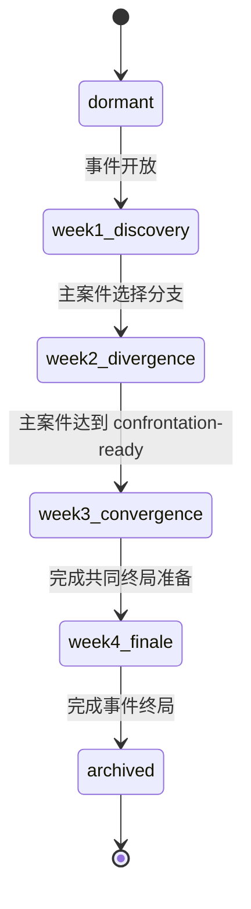

# 星球探险：四周星域事件 MVP

## 目标

星域事件负责把多个生态调查组织成一个约四周的共同事件，回答“这个月为什么继续玩”。它不复制生态调查状态机，不增加常驻货币，也不改变远征材料、捕捉和装备的正式结算边界。

首个事件暂定为“星尘潮汐”，以已经完成闭环的“荧光沼泽·孢子异变”为主案件，再接入一个轻量伴随案件验证跨生态编排。MVP 的核心验收不是活动页完成度，而是玩家此前的调查分支和支援阵容是否会改变第四周终局。

## 系统边界

### 直接复用

- `expedition_investigation_core.js` 的案件阶段：`undiscovered → choose-branch → investigating → confrontation-ready → resolved`。
- 案件已有的分支、证据、有效远征判定、`runId` 去重和终局封存。
- “1 名领队 + 最多 2 名支援伙伴”、航段方案和局内调查节点。
- 远征历史中的 `playtest` 快照，用于比较队伍、路线、异变选择、推进节点和结算结果。
- 探索档案作为只读回顾入口；正式资产仍由宿主结算。

### 星域层新增

- 当前事件、事件起止时间和当前章节。
- 事件包含的案件槽位，以及每个案件对周目标的贡献。
- 周目标完成状态和章节推进记录。
- 第三周共同终局准备快照。
- 第四周终局变体、结局和事件归档。

### 明确不拥有

- 不重新计算生态调查证据。
- 不直接修改战斗数值或发放远征资产。
- 不按自然周强制清空进度；日期只控制内容开放，玩家未完成的章节可补做。
- 不建立第二套任务清单、活动体力、活动货币或通行证经验。

## 最小状态流



事件章节只能前进，不能回退。章节推进由已有案件结果触发，而不是由“登录第几周”直接触发；时间门槛只决定下一章节是否可见。

| 章节 | 玩家动作 | 复用状态 | 星域层新增输出 |
| --- | --- | --- | --- |
| 第 1 周：异常出现 | 在目标生态完成一次有效远征并选择调查分支 | `undiscovered`、`choose-branch` | 事件加入档案，记录主案件分支 |
| 第 2 周：生态分化 | 完成 2 次分支调查节点，尝试匹配支援能力 | `investigating`、`lastOutcome` | 开启分支专属环境规则和伴随案件 |
| 第 3 周：方向汇合 | 主案件累计 4 条证据，完成生态首领 | `confrontation-ready`、`resolved` | 固化终局准备快照和可用优势 |
| 第 4 周：共同终局 | 完成 3 层事件终局 | 案件结局、支援专精、试玩记录 | 生成首领变体、救援对象、结局和纪念档案 |

## 周推进规则

### 第 1 周：异常出现

- 使用荧光沼泽案件的首次有效远征和分支选择，不增加新局内节点。
- 星域层只在玩家选择分支后写入 `primaryBranchId`。
- 本周确认问题：“异常来自失踪伙伴的迁徙，还是地下遗迹的泄漏？”

### 第 2 周：生态分化

- 复用现有 `rescue-trace` / `sunken-terminal` 节点。
- 完成任意 2 次有效分支调查即可进入下一阶段；仍遵守每局最多增加 1 条证据。
- 匹配的寻迹或修复支援只改变节点处理方式，不直接增加额外证据。
- 伴随案件只提供 1 个异常发现和 1 个选择，不在 MVP 中复制完整四证据状态机。

### 第 3 周：方向汇合

- 主案件达到 4 条证据后复用现有三层“异变源头”终局。
- 完成后生成一次不可变的 `finalePreparation`：主分支、最后调查优势、使用过的支援专精、异变标记总量。
- 该快照决定第四周机制，避免玩家在终局前临时换队覆盖前三周选择。

### 第 4 周：共同终局

- 终局仍为三层，不延长普通 30 层远征。
- 第 1 层读取主分支：失踪伙伴分支提供救援目标；地下遗迹分支提供机关关闭路径。
- 第 2 层读取支援专精：寻迹降低伏击风险，修复保留一次机关容错，守御提供撤离保护，引导允许一次异变换取捷径。
- 第 3 层读取异变标记和案件结局，选择首领机制与结局文案；不按纯攻击数值决定优劣。
- 完成后保存结局、生态变化、救援对象和纪念物，事件转为 `archived`。

## 数据模型

星域状态继续存放在远征宿主结算对象中，与 `investigations`、`history` 同级：

```js
sectorEvents: {
    'stardust-tide-01': {
        version: 1,
        stage: 'week1-discovery',
        startedAt: 0,
        chapterAvailableAt: 0,
        primaryInvestigationId: 'glowshroom-spore-anomaly',
        primaryBranchId: '',
        sideCase: {
            id: 'crystal-drift',
            discovered: false,
            choiceId: '',
        },
        completedMilestones: {},
        finalePreparation: null,
        resolution: null,
    },
}
```

`finalePreparation` 只保存生成终局所需的稳定标量：

```js
{
    primaryBranchId: 'missing-companion',
    investigationAdvantage: 'scout',
    supportSpecialtyIds: ['scout', 'channel'],
    mutationInsights: 2,
    preparedAt: 0,
}
```

迁移规则：缺失 `sectorEvents` 时视为空对象；未知事件版本只读展示、不继续推进；事件归档后不修改原始 `resolution`。

## 内容预算

| 内容类型 | MVP 数量 | 复用 | 新增 |
| --- | ---: | ---: | ---: |
| 主生态调查 | 1 | 1 | 0 |
| 伴随案件 | 1 | 0 | 1 个发现、1 个选择 |
| 分支调查节点 | 2 | 2 | 0 |
| 生态首领终局 | 1 组 3 层 | 1 | 0 |
| 星域共同终局 | 1 组 3 层 | 0 | 3 层机制配置 |
| 支援专精变化 | 4 | 4 套规则 | 终局映射配置 |
| 结局 | 2 个主结局 + 1 个隐藏结局 | 案件结局字段 | 文案与档案展示 |
| 纪念内容 | 1 件纪念物、1 条生态记录 | 档案与珍宝容器 | 配置与美术各 1 |
| 新常驻货币 | 0 | - | 0 |

首版预计新增代码面控制在：1 个纯状态核心、1 个测试文件、宿主接入点、星图/档案各 1 个展示切片，以及小游戏内 1 组共同终局配置。首版不新增独立活动大厅。

## 首个实现切片

1. 新建纯函数 `expedition_sector_event_core.js`，只实现事件初始化、阶段计算、里程碑去重、终局准备和归档。
2. 使用现有孢子调查进度驱动第 1～3 周，不先创建伴随案件玩法。
3. 在探索档案增加事件阶段与“下一步”只读摘要。
4. 为终局准备生成稳定快照，并用测试证明后续换队不会改变已生成的终局。
5. 状态流验证后，再制作伴随案件和共同终局；不在纯状态核心验证前投入新美术。

## 验收标准

- 同一远征 `runId` 不能重复推进案件或事件里程碑。
- 时间到达但前置调查未完成时，事件不会跳章。
- 前置调查完成后，玩家可以补做此前章节，不因错过自然周丢失主线。
- 第三周生成终局准备后，更换当前队伍不会重写已保存优势。
- 不同调查分支至少改变一个终局目标和一个结局展示。
- 四类支援专精至少各改变一个终局操作或风险，不能只增加攻击百分比。
- 事件完成后保留只读档案；重复结算不重复发放纪念物。
- 旧存档、无事件存档和已完成孢子调查存档都能安全迁移。
- 不改变现有周常计数、远征资产结算和六个发布入口。

## 决策门槛

在定向试玩至少积累 10 局且包含两条调查分支、三类以上支援方案之前，不锁定共同终局的交换数值。若试玩记录显示玩家不会因调查目标换队，应先修正支援信息与路线差异，而不是增加奖励倍率。