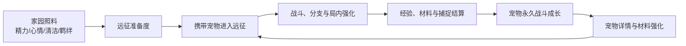

# 哈奇星球本日开发日志

**日期：2026-07-29**

本日完成了哈奇星球“日常照料 - 宠物出征 - 远征结算 - 材料养成 - 再次出征”循环的核心接入，并同步增强深空遗迹的回合可读性、局内构筑与手机端体验。

相较昨日主要完成探险入口、地图、捕捉和宠物回流，今天的改动重点是让主应用中的宠物生活状态、永久战斗成长与远征结果能够真正关联起来。

## 一、主应用与远征闭环

### 1. 出征前改为携带完整战斗快照

主应用在启动星球探险前，会先标准化选中宠物的数据，并传入以下安全快照：

- 宠物当前的派生战斗属性，而非只传递旧版展示数值。
- 精力、心情、清洁、羁绊四项生活属性。
- 根据生活属性计算出的远征准备度。
- 本次远征唯一 `runId`，作为结算幂等标识。

准备度按精力 35%、心情 30%、清洁 20%、羁绊 15% 计算为 0 至 100 的分数，并映射为“元气满满、状态良好、正常出发、需要照料、虚弱出发”五档状态。准备度会影响远征起始生命、魔力、护盾、治疗与移动消耗，使家园照料直接成为探险前的战术准备。

### 2. 远征结算正式接入主应用

远征小游戏结束后，主应用除了处理最多 3 只捕获宠物，也会结算出战宠物的经验和材料。

- 经验由普通战斗、精英战斗、已完成节点和 Boss 击破奖励共同计算。
- 经验达到阈值后会自动升级，并获得生命、魔力、攻击和防御成长。
- 生命碎块、魔力尘、攻击晶核、守护甲片、星核精粹会进入主应用背包。
- 已结算的 `runId` 会被记录，同一局重复回传不会重复加经验或材料。
- 结算成功后会保存宠物、背包和用户资料，并回到星球探险地图显示本次获得的经验与材料提示。

这部分将“副本内的展示结算”接到了主应用的永久数据层，避免远征奖励只停留在页面里。

## 二、宠物永久成长与详情页

### 1. 统一宠物战斗数据结构

新增宠物战斗属性核心模块，将宠物战斗能力拆分为三层：

- **基础属性**：按 N、R、SR、SSR、UR 品质提供生命、魔力、攻击、防御、魔法、幸运模板。
- **成长属性**：通过远征材料提升，设有按基础属性比例计算的成长上限。
- **训练属性**：预留为后续训练、装备和其他长期系统提供叠加入口。

旧版宠物读取时会被自动迁移，补齐等级、经验、基础属性、成长属性、训练属性以及精力、心情、清洁、羁绊等生活数值；派生战斗属性会在每次成长后重新计算。

### 2. 宠物详情页扩展

宠物列表中的战斗属性弹窗已改为完整的详情面板，包含：

- 家园生活：四项生活条和当前远征准备度等级、分数。
- 永久战斗：等级、经验进度条，以及生命、魔力、攻击、防御、魔法、幸运六项派生属性。
- 材料成长：每项属性显示当前成长值、成长上限、所需材料库存和可用的 `+` 按钮。

玩家消耗一份对应材料即可提升一点成长属性。操作会校验背包数量和成长上限；保存失败时会回滚宠物成长值与背包数量，避免本地数据出现半完成状态。

### 3. 开发控制台同步更新

开发控制台的满属性操作现在会同步补齐四项生活属性、永久创伤默认值与战斗数据结构，保证测试账号和正常流程产生的宠物使用同一套成长模型。

## 三、深空遗迹单局体验

### 1. 敌方意图系统

战斗界面新增敌方意图卡。每个敌方回合前，玩家可看到下一步行为及关键数值。

- **攻击**：展示预计伤害；蓄力完成后会转为更高伤害的蓄能冲击。
- **防御**：敌人获得护盾，玩家伤害会优先被护盾吸收。
- **蓄力**：预告下一回合强化攻击；Boss 低血量时可进入核心过载。
- **侵蚀**：对玩家施加持续若干回合的攻击削弱。

### 2. 局内肉鸽强化调整为四选一

普通和精英战胜利后会提供仅对当前对局生效的强化。强化覆盖攻击倍率、护甲、护盾、治疗、暴击、回魔和终结技增伤，并会根据清洁度、羁绊、活力、心情解锁准备度专属选项。

本日由三选一调整为**固定四选一**，并加入两张通用卡，确保低养成状态也能稳定生成四个选项：

| 强化 | 效果 |
| --- | --- |
| 遗物回收 | 立即恢复最大生命的 22%。 |
| 精准棱镜 | 本次远征暴击率提高 12%。 |

手机端强化弹窗使用稳定的 `2 × 2` 网格，桌面端使用四列展示。

### 3. Boss 战利品结算页

深空遗迹击败 Boss 后进入专用结算页，展示伙伴等级、本局经验预览、按材料种类合并的战利品卡和返航入口。材料类型与主应用背包的成长材料保持一致，减少副本与主应用之间的概念断层。

## 四、家园珍宝与繁育规则基础

今日还新增了两套不依赖页面的纯规则模块，为后续 UI 和存档接入提供稳定边界。

### 1. 家园珍宝

新增矿阵、清风滤芯、星光温室、余烬反应炉四类珍宝标识，并提供：

- 从现有库存和旧版 `homeTreasures` 数据兼容读取数量。
- 判断是否拥有指定珍宝。
- 按本地自然日记账的每日效果领取方法，防止同日重复领取。

### 2. 繁育与 UR 突变

新增营地繁育规则：

- 两只不同、未锁定、成年或老年、且战斗等级达到 40 的宠物才能繁育。
- 五项资质按随机主亲本 65% 加双亲平均 35%，再叠加小幅波动生成。
- 子代 DNA 按片段继承，并带有字符级突变概率。
- 常规品质继承最高不超过 SSR。
- 仅 SSR × SSR 具备 1% 的 UR 基因突变概率；成功时记录专属物种、金色二维光环、基础战斗倍率和成长倍率。

### 3. 正式交互、存档与战斗接入

家园珍宝和繁育现已从规则层接入玩家实际路径：

- 击败 Boss 会稳定获得一件家园珍宝，并在副本结算页展示；主应用将其与材料、经验放在同一 `runId` 幂等结算内写入背包。
- 背包新增“家园珍宝”区域，已拥有的珍宝可展示每日效果并领取；领取会保存每日标记，同日第二次领取会被拦截。
- 孵化舱只会在存在两只不同、未锁定、永久战斗达到 LV.40 的本星球成年宠物时开放繁育；父母选择器也只展示合格宠物。
- 确认繁育后，玩家会经过原有的放养确认和倒计时，生成的新蛋保存父母、遗传 DNA、IV、品质、成长倍率与基础战力倍率。
- UR 的基础战力倍率和成长倍率已计入永久战斗派生属性与成长上限，并在宠物战斗详情中显示；训练属性仍是后续装备系统的预留入口。

## 五、响应式与验证

对战斗 HUD、技能栏、敌方意图卡、强化弹窗、结算面板和材料网格补充了统一的防溢出规则：Grid/Flex 子项允许收缩，长文本使用省略，正方形图标受尺寸约束，小屏字体和间距使用 `clamp()` 调节。

已完成的浏览器验证包括：

- 游戏实例可正常创建，敌方意图可随回合生成和刷新。
- 敌方护盾会优先吸收攻击与技能伤害。
- 手机视口 `390 × 844` 下强化弹窗稳定生成 4 张卡、两列两行，且无横向溢出。
- 战斗底栏与结算退出区域保留 `12px` 底部安全空间，背景样式正常。
- 远征启动会携带派生属性、生活属性和准备度；主应用已接入经验、材料与幂等结算代码。
- 宠物详情页已接入生活状态、准备度、经验进度和材料成长操作。

### 本轮实际体验验收与修复

本轮按玩家路径在桌面和手机视口复查了上述体验，并修复了三个会导致功能不可用或不可感知的问题：

- 敌方意图逻辑已存在但被后置 CSS 的 `display:none!important` 隐藏；现已恢复显示。实际验证了爪击、遗迹护壁、能量蓄积、星尘侵蚀和 Boss 核心过载五类意图。
- 宠物属性弹层在小屏应用缩放下会被错误地居中到视口外；现属性遮罩脱离全局缩放上下文。手机实测弹层、关闭按钮和内部材料列表均可见、可滚动，且无横向溢出。
- 远征入口曾将宠物和远征对象直接转为 `[object Object]` 写入 iframe URL，副本无法读取出战快照；现对象参数会 JSON 编码。实测从星图点“开始探险”后，副本 URL 可解析出宠物 ID、六项战斗属性、准备度、30 个远征节点和本局 `runId`。

此外，已在桌面与手机端实测副本的敌方意图卡、四选一强化布局、强化选择回调与 Boss 结算页。材料成长的“库存不足”反馈已可由真实按钮触发；有材料消耗后的主应用持久化继续由远征结算和规则回归覆盖。

随后又按真实玩家入口补测家园珍宝、UR 战斗属性和繁育：

- Boss `gameFinished` 回传包含家园珍宝；桌面及窄屏副本结算页均展示珍宝奖励，窄屏为单列且无横向溢出。
- 背包中的珍宝卡可实际领取奖励：星轨矿阵首次领取增加 60 星币，第二次领取不重复增加；窄屏领取按钮会换到卡片下一行，保持可点。
- UR 样例在实际属性弹窗显示“基础战力 ×1.75 · 成长上限 ×1.6”，攻击从 120 计算为 198，攻击成长上限从 60 计算为 96。
- 繁育入口会正确拦截 LV.39 父母；两只 LV.40 SSR 父母可完成选择、放养确认与倒计时。实测生成的新蛋成为当前宠物，扣除 30 金币，并保存父母 ID、IV、SSR 品质、遗传 DNA、成长倍率和基础战力倍率。

## 六、本日涉及模块

- `webgames/MagicHaqi/js/app.js`
- `webgames/MagicHaqi/js/view_petList.js`
- `webgames/MagicHaqi/js/view_dev_console.js`
- `webgames/MagicHaqi/js/pet_stats_core.js`
- `webgames/MagicHaqi/js/expedition_buff.js`
- `webgames/MagicHaqi/js/expedition_settlement.js`
- `webgames/MagicHaqi/js/home_treasures.js`
- `webgames/MagicHaqi/js/pet_breeding_core.js`
- `webgames/MagicHaqi/minigames/haqi_planet_expedition.html`

## 七、后续工作

- 将家园珍宝扩展为可摆放的家园设施，并补充各设施的长期成长效果。
- 为繁育加入血统展示、可预览的资质区间与更多亲代组合反馈。
- 实现独立装备系统，并明确其与训练属性、UR 倍率的叠加规则。
- 持续进行完整单局人工游玩，覆盖普通、精英、商人、营地、Boss 与中途失败分支。
