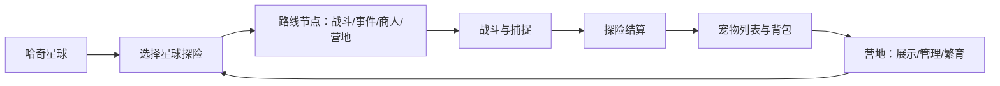

# 哈奇星球与星球探险更新说明

**覆盖时间：2026-07-27 至 2026-07-28**

本次更新围绕“从星球探险获得伙伴，再回到哈奇星球持续培养”的循环，新增两条可游玩的探险入口，并补全了宠物品质、捕捉回流、营地孵化和跨页面存档能力。

## 一、整体玩法闭环

玩家从哈奇星球进入探险，选择路线并完成战斗、事件、商人或营地节点；在战斗中可使用捕捉胶囊带回伙伴。探险结束后，捕获的宠物会结算进入主应用的宠物列表，保留来源、品级、战斗属性和立绘；玩家随后可在营地查看、管理和繁育宠物。

探险小游戏通过 `postMessage` 向主应用提交通关状态、分数、积分、完成时间和捕获宠物；主应用只接收最多 3 只捕获结果，创建新宠物并存档。因此一次远征既是即时战斗内容，也是扩充宠物收藏和培养资源的主要入口。

## 二、星球探险：主应用日常远征

### 1. 每日随机远征

主应用会按“当前日期 + 哈奇星球名称”生成确定性的每日种子，同一天内玩家看到的远征保持一致，隔日自动刷新。每天提供 2 至 3 个不同主题的目的地，覆盖泡泡草地、迷雾森林、月湾海滩、糖晶沙漠、荧光沼泽和碎岩遗迹等生态。

每个目的地具备普通、挑战或危险难度，并由 30 个航段构成；终点固定为“星核终局”Boss。节点类型包括：

- **普通战斗**：遭遇对应生态与进度的敌人，取得基础资源。
- **精英战斗**：敌人更强，战胜后获得更高回报与强化机会。
- **随机事件**：以选择换取治疗、攻击、暴击或资源等即时收益。
- **流浪商人**：用星币购买手雷、攻击提升等战术资源。
- **营地**：在恢复生命与提升攻击之间选择，为后续航段做准备。
- **Boss 终局**：完成远征的最终目标，结算更高奖励。

敌人会随航段推进逐步提高品质和强度：前段以普通敌人为主，后段会出现稀有、精英、史诗和传说敌人。捕获来源的稀有度同时会映射为宠物品质，形成探索深度与收藏价值的对应关系。

### 2. 远征携带与安全数据

出发前，主应用将选中的宠物收敛为探险所需的安全快照：名称、立绘、稀有度、成长阶段、品质、战斗属性与基础属性。小游戏只使用该快照进行展示和战斗，不直接改写主宠物档案；结算后再由主应用统一创建或更新宠物数据，降低跨页面数据互相污染的风险。

## 三、深空遗迹：分支肉鸽探险

除日常远征外，新增独立的“哈奇星球·深空遗迹”玩法。它采用单次约 10 至 15 分钟的肉鸽式推进，核心是“看地图选分支、临场强化、挑战终局”。

### 1. 分支星图与路线抉择

深空遗迹使用多层分支地图：玩家只能选择当前可达节点；一旦选择其中一条分支，同层其他分支会被锁定。地图包含普通战斗、精英、事件、商人、营地和最终 Boss；中段会出现精英或大型商人，后段出现营地，终层为 Boss。

这使每局都有明确取舍：玩家可以选择较稳妥的营地与普通战斗路线，也可以冒险挑战精英来换取更强的即时成长。

### 2. 回合制战斗和主动技能

战斗采用回合制。玩家需要在每回合使用攻击、治疗、护盾与消耗品，在敌方回合来临前处理威胁。基础战斗资源包括生命、魔力、攻击、护甲、暴击、吸血、护盾、治疗冷却和手雷库存。

战斗中支持以下成长方向：

- 暴击、暴击伤害、攻击与固定减伤。
- 生命上限、魔力上限、开局魔力和战斗内恢复。
- 吸血、护盾和护盾回合衰减。
- 手雷等一次性战术道具。
- 遗物技能，例如额外技能、随机重掷或资源转化能力。

普通节点、精英节点和 Boss 会带来不同的敌方强度与奖励。精英战可触发强化选择；Boss 胜利后进入最终奖励环节。部分 Boss 机制会改变行动节奏，例如多段攻击、压制魔力等，因此需要根据已取得的强化调整出招和资源保留。

### 3. 节点奖励与局内经济

普通战斗、精英和 Boss 分别会提供递增星币；星币可在商人处购买手雷或永久攻击提升。营地提供两种方向：回复最大生命的一定比例，或用恢复机会换取攻击成长。

事件不是纯文本，而是带有明确数值后果的选择。例如玩家可能选择恢复生命、以生命换攻击、提高暴击、获得星币与道具，或从随机池中拿到尚未拥有的遗物技能。这些选择共同决定一局的构筑方向。

### 4. 遗物强化与通关结算

战斗后可从随机三选一强化中选择，例如吸血、暴击、生命扩容、攻击、护甲、初始魔力、爆伤、反应护盾、即时星币或能量储备。部分强化还会有概率额外授予遗物技能。

击败最终 Boss 后进入奖励环节并计算积分；中途失败也可提交本次已完成的探索数据。结算消息会携带积分、得分、击杀数、是否通关、完成时间及携带宠物标识，供宿主页面完成积分、星球归属和后续展示处理。

## 四、捕捉与宠物回流

### 1. 捕捉结果

战斗内使用捕捉胶囊成功后，目标会加入本局的捕获列表。捕获记录包含物种标识、名称、DNA、来源稀有度、品质、战斗属性和立绘地址；主应用结算时将其转为正式宠物，初始状态包含饥饿、心情、清洁和羁绊等养成数值。

同一局最多结算 3 只宠物，避免单局产出失控，也便于结算页与宠物库管理。

### 2. 品质映射

新增统一的五档宠物品质：

| 品质 | 名称 | 对应探险来源稀有度 | 基础战斗定位 |
| --- | --- | --- | --- |
| N | 初芽 | 普通 | 入门伙伴 |
| R | 碧潮 | 稀有 | 常规成长 |
| SR | 幻晶 | 精英 | 中阶战斗能力 |
| SSR | 耀阳 | 史诗 | 高阶战斗能力 |
| UR | 星辉 | 传说 | 顶级战斗能力 |

每档品质具有固定的生命、魔力、防御、力量、魔法和幸运基础模板。探险宠物会优先使用按来源稀有度换算的品质，并合并捕获时产生的战斗属性，使“在哪里捕到、捕到什么等级的敌人”能直观反映在宠物实力上。

### 3. 立绘与兼容修复

探险物种已配置到对应的宠物立绘资源。当前本地未提交改动还补上两层兼容逻辑：捕获瞬间将当前战斗使用的立绘写入捕获记录；主应用启动时，会为旧版已结算但缺失立绘的探险宠物按物种补齐并保存。这样新捕获宠物和历史探险宠物都能在宠物列表、营地与展示界面稳定显示。

## 五、宠物营地、存储与繁育

### 1. 跨页面宠物库

新增统一宠物库 `HaqiPetRoster`，用于营地、孵化器和其他哈奇星球页面共享宠物数据。系统会在首次使用时创建初始抱抱龙，并对读取到的宠物进行标准化：补齐名称、等级、最大等级、立绘、资质、被动技能栏与视觉配置。

宠物库最多保存 120 只宠物。每次写入后会派发宠物库变更事件，让同一页面内的展示区域能够及时刷新。

### 2. 稀有度视觉规范

宠物、蛋和孵化器均采用正方形资产和俯视二维展示。N、R、SR、SSR、UR 分别有对应的品级染色与光效；UR 保留原始色彩并使用金色光效及二维平面光环。该规范避免立绘拉伸，也确保营地、宠物卡与孵化器的视觉表达一致。

### 3. 繁育与孵化

营地支持从两只符合条件的宠物生成后代。参与繁育的双亲必须不同，且不能处于锁定或派遣状态。子代具备独立实例标识、世代记录、父母记录、等级、资质、被动技能栏、视觉数据和突变记录。

资质包含生命、攻击、防御、速度和天赋五项。每项资质按“随机主亲本 65% + 双亲平均值 35% + 小幅随机浮动”生成，并限制在 0 至 100 范围内。品级通常由父母品级决定且会有上下浮动；常规遗传最高可到 SSR。当两只 SSR 宠物繁育时，会额外触发 1% 的 UR 突变判定，UR 后代会获得专属视觉表现。

被动技能会从双亲已解锁技能中去重继承，槽位数量随品级提高，最多 5 个。由此形成“探险收集高品质宠物 - 营地筛选资质和技能 - 繁育尝试更高价值后代”的长线成长目标。

## 六、入口与测试重点

- 主应用入口：星球探险地图、小游戏列表和宠物列表已接入新远征内容。
- 独立入口：`minigames/haqi_planet_boarding_haqi.html` 提供深空遗迹的完整单页玩法。
- 集成小游戏：`minigames/haqi_planet_expedition.html` 负责主应用探险战斗、捕获和结算回传。
- 可视化验证页：设计目录内包含玩法测试台、营地与孵化器页面，可用于检查地图路线、宠物卡、品级视觉和繁育输出。

建议验收时重点检查：分支地图是否正确锁定未选路线；普通、精英、商人、营地和 Boss 是否都能完成；捕捉是否最多结算 3 只；回到主应用后宠物是否带有品质、属性和立绘；刷新后旧探险宠物立绘是否仍可显示；以及 SSR x SSR 的繁育是否能正确记录 UR 突变概率与结果。