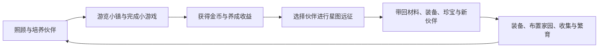

# 哈奇星球玩法介绍

哈奇星球是 MagicHaqi 中面向怀旧老玩家和爱冒险玩家的官方主题星球。玩家可以陪伴抱抱龙成长、重游哈奇小镇的七个场景、与 NPC 玩经典小游戏，并通过星图远征收集伙伴、装备、材料和家园珍宝。

本文只介绍当前可进入、可游玩的内容。数值奖励、每日星图和商店内容会随版本或运营活动调整。

## 1. 如何进入

使用以下链接进入哈奇星球：

```text
MagicHaqi.html?home_planet=haqi
```

该入口会加载“魔法哈奇-抱抱龙”主题、哈奇小镇场景和哈奇专属远征功能。首次进入后，按提示创建或选择伙伴即可开始体验。

哈奇星球采用常规养成节奏：伙伴的体力、心情、清洁和亲密度会随时间变化，需要持续照顾。

## 2. 核心循环



日常体验分为两条主线：

- **陪伴养成**：喂食、玩耍、洗澡、睡觉、聊天、装饰家园，让伙伴维持良好状态。
- **冒险收集**：通过小镇 NPC 小游戏和哈奇专属远征取得资源，扩充伙伴收藏与战斗能力。

## 3. 四级视角与基础养成

主界面支持通过手机滑动/双指缩放，或电脑滚轮，在四个视角间切换。

| 视角 | 主要玩法 |
| --- | --- |
| 宇宙 | 查看星球、领取离线金币、进行星际相关活动。 |
| 星球 | 进入哈奇小镇场景、清理地表、摆放户外物品和使用珍宝设施。 |
| 宠物 | 在房间中喂食、玩耍、洗澡、睡觉，切换房间并布置家具。 |
| 细胞 | 查看 DNA 与食性提示；伙伴生病时可进入体内治疗玩法。 |

伙伴有四项关键状态：

| 状态 | 主要恢复/提升方式 |
| --- | --- |
| 体力 | 喂食、休息。 |
| 心情 | 玩耍、陪伴、部分食物与活动。 |
| 清洁 | 洗澡、清理地表。 |
| 亲密度 | 玩耍、照顾、聊天及部分探索活动。 |

### 喂食与特征

从商店购买或获得食物后，在宠物层选择喂食。伙伴的 DNA 决定肉食、素食或杂食偏好；不符合偏好的食物可能被拒绝且不会消耗。

带有特征倾向的食物会影响伙伴的种族特征，例如胡萝卜偏向兔形、烤肉偏向猫科、小鱼干偏向鱼形、火焰椒偏向龙形。蛋阶段第一次成功喂食会触发孵化，因此食物选择也会影响最初的伙伴形象与族系方向。

### 日常互动与治疗

- **玩耍**：进入小游戏，通常提升心情和亲密度，并按通关、得分和难度结算金币。
- **洗澡**：恢复清洁，适合伙伴或地表较脏时使用。
- **睡觉**：低体力时恢复状态；夜间休息会持续到次日。
- **细胞治疗**：伙伴生病时，细胞层会提供治疗入口；完成细胞免疫塔防可降低病情，完全治好后才会保存康复结果。
- **聊天与记忆**：可与当前伙伴文字对话；每只伙伴拥有独立记忆。具备会员/VIP 权益时可使用数字人语音互动。

## 4. 哈奇小镇七大场景

哈奇星球默认从星球场景进入。场景中的 NPC 会发起对话并提供经典小游戏入口；完成游戏可获得常规小游戏结算奖励。

| 场景 | 可遇 NPC | 玩法特点 |
| --- | --- | --- |
| 小镇广场 | 哈奇岛大使、罗德镇长 | 回归小镇的起点，可体验经典闯关小游戏。 |
| 阳光海滩 | 咕噜大叔、冬冬 | 海滩主题小游戏与轻松互动。 |
| 魔法密林 | 多多、多克特博士 | 森林探索氛围，提供怀旧挑战小游戏。 |
| 游乐场 | 香蕉先生、YY 公主、丹瑟 | 游乐场主题小游戏，包括舞蹈和轻松玩法。 |
| 雪山 | 尤诺、古奇 | 冰雪主题的跳跃、雪球等挑战。 |
| 魔法学院 | 白龙导师、青龙导师 | 学院主题小游戏与导师互动。 |
| 跳跳农场 | 咕噜大叔、莫卡 | 农场主题小游戏，包括浇水、祖玛等玩法。 |

场景按主题配置背景、粒子效果和音乐。NPC 与玩家主伙伴会在场景内出现；点击 NPC、阅读对话并确认后即可进入对应游戏。

## 5. 小游戏、创造与故事

### 官方小游戏

除了场景 NPC 入口，宠物层的“玩耍”也提供官方小游戏列表。现有内容覆盖动作、反应、益智、棋类、经营和编程启蒙方向，例如宠物冒险、荒野生存、雷电挑战、贪吃蛇、祖玛、泡泡龙、三消、台球、推箱子、激光迷宫、象棋、五子棋和矩阵破解等。

完成小游戏时，系统会依据游戏的通关状态、得分、时长和难度计算金币；不同游戏奖励范围不同。同时，部分游戏会提高心情和亲密度。

### 小游戏创造工坊

在玩耍页切换到“创造”，可使用 AI 小游戏创造工坊：

1. 用自然语言描述想制作的游戏。
2. 让 AI 生成并实时预览 HTML5 小游戏。
3. 继续通过对话迭代玩法、画面、规则和参数。
4. 保存到“我的”列表，之后可再次试玩、编辑或分享。

工坊支持灵感推荐、图片参考、代码查看与编辑、错误修复、配置调整和美术资源管理。自制小游戏不会直接改写伙伴成长数据。

### 故事创作

从主菜单可进入故事创作器。玩家能够使用自己的伙伴与角色制作互动故事，安排场景、对白、动作、选择与简单任务，并保存、回放或分享给其他玩家体验。

## 6. 哈奇专属：今日星图远征

“今日星图”是哈奇星球专属玩法，其他星球不会显示或结算该功能。它也是哈奇新手任务的第 4、5 步：完成首次远征，再查看远征记录。

### 远征如何开始

1. 在哈奇星球进入“今日星图”。
2. 每天从固定生成的 3 颗目的地星球中选择一颗尚未探索的星球。
3. 选择一只在家的可出战伙伴。
4. 点击“开始探险”，进入远征小游戏。

每日星图的目的地会在当天保持一致，隔日刷新。每颗目的地当天只能完成一次；三颗均探索后，需要等待次日的星图。

### 本周研究航线

每周会轮换一项生态研究主题。今日星图会显示该主题的进度，并为当日符合目标生态的目的地标记“本周研究目标”，帮助玩家决定优先探索哪颗星球。完成该主题的两次成功远征后，标记会停止推荐；本周航线只汇总既有远征和矿区进度，不额外发放或扣除资产。

### 星图结构与节点

每次完整远征包含两章、每章 15 层，共 30 层。目的地具有独立生态与难度，沿途可能遇到：

- **普通战斗**：取得基础资源并推进路线。
- **精英战斗**：挑战更强敌人，换取更高回报或强化机会。
- **随机事件**：在治疗、攻击、暴击、资源等效果中做选择。
- **流浪商人**：消耗星币购买手雷、攻击提升等战术资源。
- **营地**：在恢复生命与提升攻击之间取舍。
- **Boss 终局**：完成本次远征并获得更高结算收益。

出发时，主应用会将伙伴的名称、形象、阶段、品质、战斗属性和基础状态作为安全快照交给远征。远征过程不会直接改写主档案，结束后再统一结算，避免跨页面状态冲突。

### 捕捉、结算与记录

战斗中可以使用捕捉胶囊收服遭遇伙伴。单次远征最多带回 3 只；结算后，它们会进入宠物列表，保留探险来源、品质、战斗属性和立绘。

#### 伙伴稀有度与捕捉规则

高品质伙伴由“遭遇权重 + 捕获上限 + 品质跃升”三层共同控制，而不是只靠降低一种概率。每日星图使用随深度逐步解锁的确定性加权遭遇表：

- 前 10 层以普通、稀有伙伴为主，只保留极低的 SR 遭遇；不会出现 SSR 或 UR。
- 第 11 至 22 层开始出现极低概率 SSR，仍不会出现 UR。
- 第 23 层后才开放 UR 遭遇；第 28 层后才有极低概率出现。第 30 层传说 Boss 不可捕捉。
- 同一来源稀有度的捕获成功率有独立上限：N `45%`、R `32%`、SR `16%`、SSR `7%`、UR `2.5%`。将敌人控至低生命、选择捕捉相关遗物与补给仍然重要，但不能把高品质目标堆至必定捕获。
- 星际金主协议保留品质跃升，但单次成功捕获仅有 `4%` 概率提升一档品质；它用于提供惊喜，不替代长期收集与繁育目标。

这套规则的目标是让 SR 成为可期待的阶段收获，SSR 成为多次远征的目标，而 UR 保持为需要长期探索、选择与繁育共同追求的稀有成果。

远征成功还可能获得以下内容：

- **材料**：进入背包，用于远征相关成长。
- **装备**：可在伙伴战斗面板装配，提升远征派生属性；重复装备会转化为星核精粹。
- **家园珍宝**：可放置到星球地块。摆放后可领取其每日设施效果，例如金币或生物燃料收益。
- **远征历史**：今日星图保留最近远征记录，显示出战伙伴、目的地、完成层数、战利品数量、带回伙伴数量、结果和时间。

#### 星图压力与长期挑战

普通、挑战、危险是目的地原有的路线难度。伙伴养成超过常规基线后，常规远征还会显示“星图压力”：系统会根据出战伙伴的攻击、魔法、生命和防御，吸收一部分超额战力来提高敌人的生命与伤害。

- 基线以内不会增加压力，早期和中期伙伴仍按路线原有难度探索。
- 压力只吸收部分额外成长，最高为 `+80%`；装备、矿区和物种专精依然会让伙伴更强，但不会让长期账户无限制碾压整条路线。
- 星图入口会显示“标准”或“+X%”，进入远征时也会再次说明本局压力。物种专精的攻防加成已计入该预览。
- 道馆采用固定楼层守卫阵容，不受星图压力影响。

### 守护大师友好道馆

成功远征会同时推进道馆资格：每成功结算 2 次远征，获得 1 张“挑战函”，最多可持有 2 张。今日星图会显示当前挑战函数量，以及下一层可首通的道馆层数。

守护大师友好道馆是一条独立的多伙伴挑战路线：

- 首版为 5 层爬塔；每一层的 NPC 守护者携带 3 只逐层强化的伙伴，玩家也携带 3 只伙伴进行车轮战。
- 在今日星图中选择 3 只未派遣伙伴，并确定出战顺序；每击败一位守卫或一只己方伙伴倒下，战场会自动换上下一位，直到一方三只伙伴全部无法继续战斗。
- 新层必须按顺序首通。首次挑战一层会消耗 1 张挑战函；未获胜时不会解锁下一层。
- 一层首通后永久解锁下一层，并获得该层完整的首次奖励。已首通层可在道馆面板选择对应楼层再次练习，重打时不消耗挑战函，但胜利奖励只有首次奖励的 `50%`。
- 奖励定位为金币、星核精粹、防护类材料和路线资源，服务于更多构筑选择；不以直接无限抬高攻击作为主要奖励。
- 道馆沿用星图远征的回合制战斗、技能、护甲和敌方意图。胜负与中途离开均由对战页面回传统一结算；同一场挑战重复回传不会重复扣除挑战函或发放奖励。

道馆强调阵容轮换、克制和生存资源。它的目标是让培养多只伙伴始终有意义，而不是只依赖一只数值最高的伙伴完成所有冒险。

### 长线挑战方向

今日星图的常规远征用于稳定获取日常资源。后续会开放可选的挑战远征，玩家可以主动选择危险等级和异变规则，例如敌方护盾、蓄能攻击、治疗衰减与环境侵蚀。

挑战远征不会对玩家的全部额外战力做一比一敌方缩放。系统只会将超过章节推荐基线的部分战力约 `35% - 45%` 转化为敌方补偿，并通过异变机制要求不同的队伍与策略。这样强化仍能带来稳定成长，同时不会让长期账户在高难目标中变成无风险碾压。

## 7. 深空遗迹：分支肉鸽探险

哈奇星球还提供独立的“深空遗迹”远征入口，适合一局约 10 至 15 分钟的肉鸽式挑战。

玩法要点：

- 在多层分支星图中选择可达节点；选择一条分支后，同层其他路线会锁定。
- 在普通战斗、精英、事件、商人、营地与 Boss 之间做风险和资源取舍。
- 使用攻击、治疗、护盾、手雷等主动操作处理回合制战斗。
- 从战斗与事件中选择三选一强化，构筑攻击、暴击、护甲、吸血、生命、魔力、护盾与遗物技能等方向。
- 通过终局 Boss 后进行积分和奖励结算；中途失败也会记录本次探索结果。

### 星核与战术技能

- **星核爆裂**是消耗全部 MP 的稳定通用终结技：适合在没有特定构筑、需要可靠收尾时使用。
- 战术芯片不是星核的低配替代。攻击类芯片以“攻击 + 魔法的 60%”作为魔导强度结算，因此高魔法伙伴能把芯片构筑转化为明确的输出优势。
- 糖果陨石、星爆脉冲和潮汐连射属于高阶爆发：前两者可在满 MP 星核之上造成单次伤害；潮汐连射在击败目标时返还 MP，适合连续清场。
- 霜冻脉冲、破甲震荡、纳米修复、镜像护幕、泡泡壁垒和星图回响以减攻、治疗或护盾提供战术价值；虹吸射线则把输出转为续航。技能栏显示的是基础 MP 消耗，击杀返蓝和局内回蓝强化会在结算后改变当前 MP。

深空遗迹同样强调“探索获得伙伴，再回到哈奇星球养成”的循环。

## 8. 伙伴收藏、品质与繁育

### 探险品质

远征捕获伙伴按来源稀有度映射为五档品质：

| 品质 | 名称 | 定位 |
| --- | --- | --- |
| N | 初芽 | 入门伙伴。 |
| R | 碧潮 | 常规成长。 |
| SR | 幻晶 | 中阶战斗能力。 |
| SSR | 耀阳 | 高阶战斗能力。 |
| UR | 星辉 | 顶级伙伴，带专属视觉表现。 |

品质会影响生命、魔力、防御、力量、魔法和幸运等战斗属性模板，也会影响可继承的被动技能槽位数量。

### 营地与繁育

在营地可查看和管理哈奇伙伴，并从两只符合条件的伙伴中繁育后代。双亲必须不同，且不能处于锁定或派遣状态。

子代会记录父母、世代、资质、被动技能、视觉数据和突变结果。生命、攻击、防御、速度、天赋等资质由双亲与随机浮动共同决定；品质通常围绕父母品质浮动。两只 SSR 伙伴繁育时，有 1% 概率触发 UR 突变。

这构成长期目标：远征收集高品质伙伴，筛选资质与技能，再通过繁育尝试培养更稀有的下一代。

## 9. 新手推荐路线

哈奇星球的新手目标共 5 步，完成后可领取对应金币奖励：

1. **认识你的伙伴**：打开伙伴属性，查看战斗能力。
2. **给伙伴取名**：首次改名免费。
3. **建设第一处设施**：在家园摆放一件物品。
4. **完成首次远征**：进入今日星图并完成一次远征。
5. **查看远征记录**：打开一条最近记录，确认本次旅程结果。

建议先完成前 3 步，确保伙伴已命名、家园可用，再带一只状态良好的伙伴进入远征。远征前优先检查体力；完成后及时查看战利品、装配装备、放置珍宝，并继续照顾新带回的伙伴。

## 10. 当前边界与提示

- 哈奇星球远征只在 `home_planet=haqi` 或正式定居为哈奇星球的会话中可用。
- 今日星图每天固定 3 个目的地，每个目的地每天只能探索一次。
- 捕捉结算每局最多带回 3 只伙伴。
- 家园珍宝需要先放置在星球地块上，才能领取每日设施效果。
- 远征中途离开会丢失该局未结算进度；确认开始前请预留完整游玩时间。
- 通用商店、小游戏、故事创作、AI 工坊和聊天等功能会随账号状态、网络与权限显示不同入口。