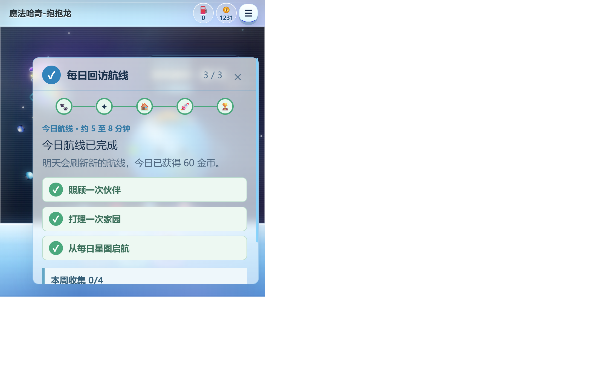
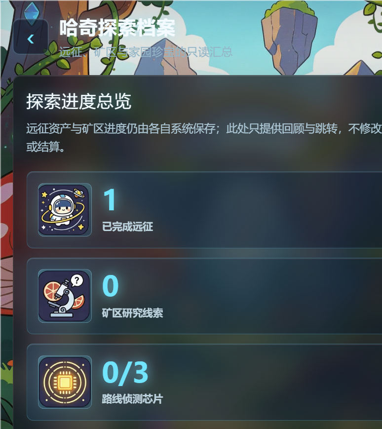
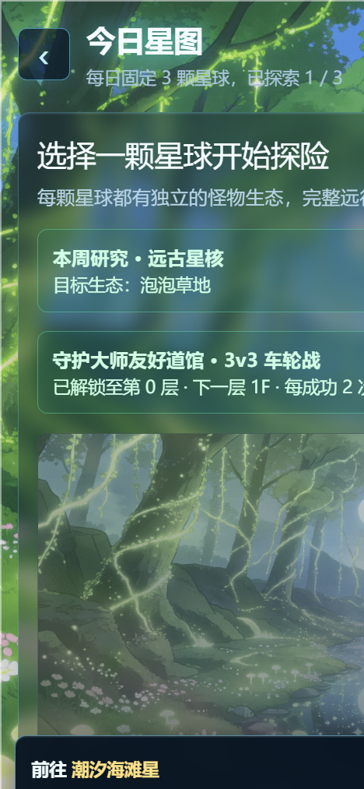
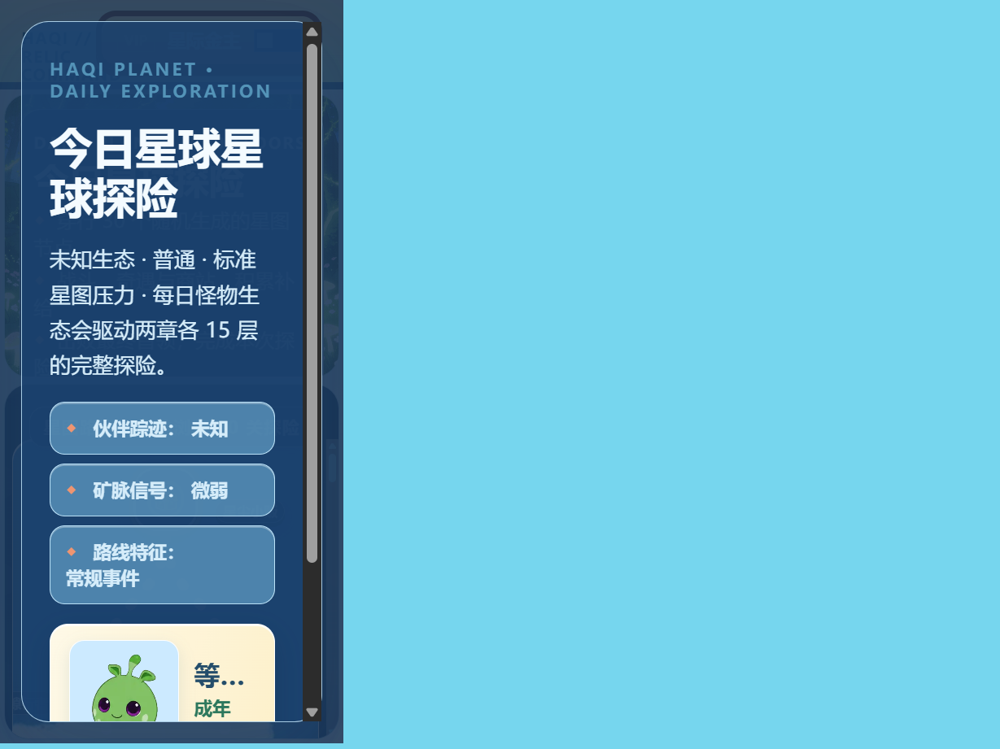

# 第 4 天阶段检查

检查日期：2026-08-28

## 阶段范围

本次检查覆盖第 1～4 天“首页、哈奇身份、每日主目标和新手前 15 分钟”阶段，不把内部回归结果等同于真人试玩结论，也不提前验收第 5～8 天内容。

## 当前结论

**通过第 4 天内部阶段检查，可以进入第 5～8 天的系统串联复核。**

依据如下：

- 首次进入、伙伴需要照料、伙伴状态良好和当日远征完成四种首页状态均由状态测试覆盖；新手期只保留五步航线作为第一主操作，完成后才恢复每日回访和长期入口。
- 干净游客已通过真实 UI 完成“相遇 → 约定 → 安家 → 启航 → 归航”，未注入存档、未越级完成任务、未伪造 iframe 结算消息。
- 哈奇星球真实存档已完成“迁移 → 建设 → 两章短航线远征 → 原生返航 → 查看记录 → 每日回访 3/3”。
- 返航获得的 184 EXP、13 份材料和余烬反应炉均由宿主原生结算写入，并可在伙伴、背包、家园和探索档案再次查看。
- 桌面、手机和 Pad 的首页、探索档案、每日星图历史及远征入口均无横向溢出、关键控件遮挡或破图。
- MagicHaqi 全量自动化测试 241/241、正式小游戏目录浏览器冒烟测试 57/57 通过，相关代码诊断为 0 错误；按项目约束未执行构建。

## 可见证据

### 1. 首页完成态与次日期待

真实存档显示“哈奇星球 · 第1天”、伙伴状态和每日回访航线 3/3；完成态仍保留明确的次日刷新提示。桌面实际 CSS 视口为 1152×720，无横向溢出，完整航线面板位于视口内。

### 2. 首日成果回流与再次查看

探索档案显示一次已完成远征、家园珍宝“余烬反应炉”和最近远征“星愿 · 材料 13”；业务页仅保留紧凑“今日”抽屉，完整航线面板不覆盖内容。

### 3. 手机端远征记录

手机实际 CSS 视口为 312×675。最近远征摘要使用“推进 3 个节点”，展开后显示正式返航、3 个节点、13 份材料、0 位伙伴和返航时间；详情完整位于视口内，“今日”抽屉不遮挡“开始探险”。

### 4. Pad 端远征入口

Pad 实际 CSS 视口为 819×614。远征入口、30 节点路线和首个可操作节点正常显示，页面无横向溢出，运行时图片破图数为 0。

## 四种首页状态的证据边界

本次没有为了补截图而修改或注入存档。四种首页状态采用“真实路径记录 + 自动化状态测试”的组合证据：

| 首页状态 | 主操作预期 | 证据 |
| --- | --- | --- |
| 首次进入 | 当前五步航线步骤 | 2026-08-27 干净游客真实 UI 实走记录；首页状态测试 |
| 伙伴需要照料 | 当前五步航线优先，或完成后的照料目标 | 真实喂食与每日回访实走记录；首页状态测试 |
| 伙伴状态良好 | 当前五步航线优先，完成后恢复日常目标 | 首页状态测试；五步完成前后切换测试 |
| 当日远征完成 | 成果查看与次日期待 | 本目录首页、探索档案和远征历史截图；真实返航存档 |

该边界保证材料可复核，同时不把构造状态截图伪装成真实玩家过程。

## 三端检查数据

| 路径 | 桌面 1152×720 | 手机 312×675 | Pad 819×614 |
| --- | --- | --- | --- |
| 首页完成态 | 通过 | 通过 | 通过 |
| 探索档案紧凑抽屉 | 通过 | 通过 | 通过 |
| 星图历史展开/收起 | 通过 | 通过 | 通过 |
| 抽屉返回首页 | 通过 | 通过 | 通过 |
| 横向溢出 | 无 | 无 | 无 |
| 抽屉遮挡核心操作 | 无 | 无 | 无 |
| 独立远征页破图 | 0 | 0 | 0 |

## 遗留问题

- 登录品牌主视觉首稿未通过视觉评审，已经撤下；现有登录流程可用，但统一主视觉仍需后续替换。
- 当前结论来自内部自动化与真实路径回归，尚未经过 10～20 名目标用户的邀请试玩，不能据此宣称留存或用户认可。
- 首批真人试玩前仍需确认稳定分发、登录存档和数据观察条件。

## 最终回归补充

- 机甲矿工已从普通小游戏目录移除，仅由矿区派遣协同和远征采矿节点以宿主模式启动；桌面、手机和 Pad 均无横向溢出、弹层越界或旧交互层重叠，提前撤离后 iframe 正确清理。
- 普通矿区同步只允许合并非经济状态，不能覆盖宿主研究、配额、物品、催化剂、工坊及防重放账本；工坊跨页面请求持久化并使用同一请求 ID 幂等恢复。
- 16 张返航奖励 WebP 均完成 CDN HTTP、类型、尺寸和浏览器解码复核；运行时加载失败会显示既有 emoji 回退，不留下破图。
- 最终自动化结果为矿区聚焦 24/24、奖励美术 5/5、公开目录 57/57、全量 Node 241/241；`git diff --check` 无空白错误，仅有既有行尾提示。

## 下一阶段入口

第 5～8 天只复核伙伴、小镇、远征、矿区和结算反馈之间的串联关系，优先处理真实路径中的断点，不新增系统替代现有关系整理。登录主视觉作为明确遗留项单独排期，不阻塞本阶段通过。
