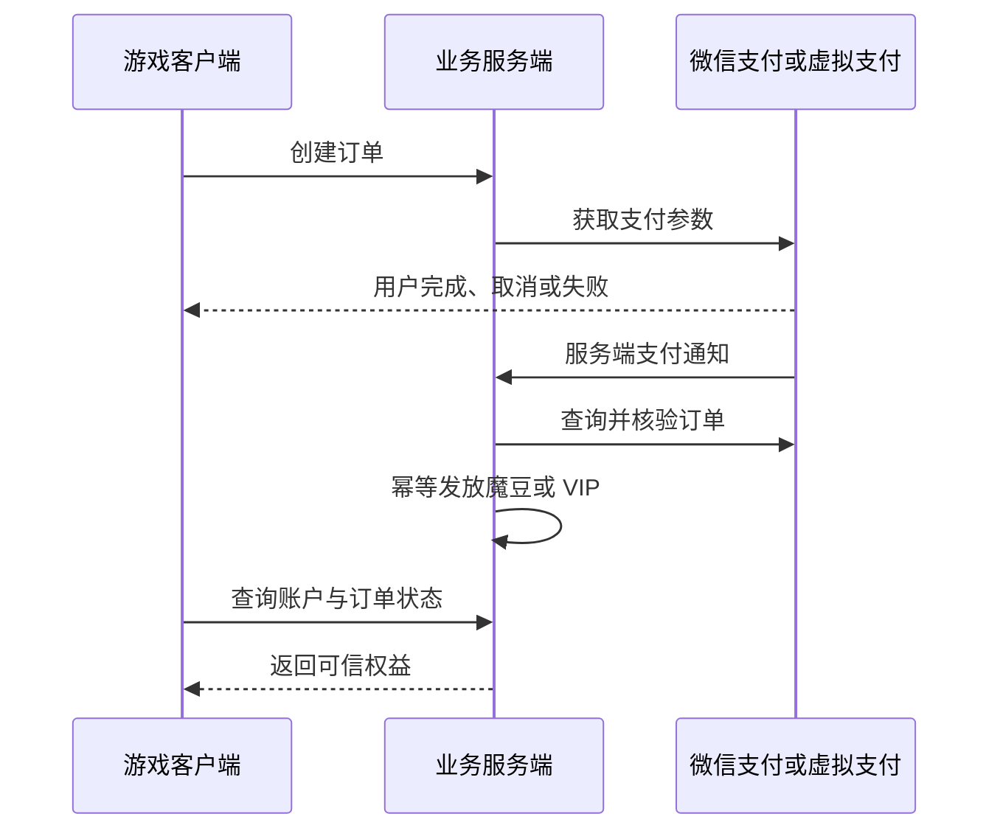

# MagicHaqi 发行与充值准备度分析

## 一、背景与当前目标

老板此前提出的目标是：

> 尽快发行并推广一轮；微信小程序支持充值，PC 端同步发放相应数量的魔豆。

这个目标实际包含两个彼此关联、但准备条件不同的项目：

1. 将游戏交付给真实玩家，验证玩法、留存、兼容性和稳定性。
2. 建立微信小程序与 PC 端共用的真实支付、订单和魔豆账户体系。

目前游戏主体已经接近可测试状态，但支付所需的渠道资质、商户能力、服务端订单和统一账户方案尚未明确。因此，“游戏能否发布”和“充值能否开放”必须分别判断，不能互相替代。

## 二、核心结论

MagicHaqi **可以先发布关闭真实充值的免费版本**，用于小规模真实用户验证；当前不适合以“充值和 VIP 已可用”的商业正式版对外发布。

这不是因为游戏不能玩，而是因为真实支付涉及资金安全、微信平台规则和服务端可信状态。在支付条件未齐时，可以先让游戏上线，但必须隐藏或关闭真实充值入口，避免玩家进入无法完成或无法保障权益的付费流程。

建议采用以下原则：

> 游戏先小批上线，充值准备完成后再开放；首轮不一次耗尽全部渠道和用户。

## 三、为什么先发不带充值的版本

自动化测试和内部浏览器验证只能证明已覆盖路径按预期运行，不能证明大量真实用户在不同设备、网络和操作习惯下都能顺利游玩。首批真实用户主要用于验证：

- 新玩家是否能独立完成登录、新手任务和核心玩法。
- 微信容器、手机、Pad 和 PC 上是否存在兼容或操作问题。
- 登录、存档、刷新恢复和跨设备数据是否可靠。
- 玩家是否理解金币、魔豆、商店、宠物照料和回访目标。
- 玩家第一天玩到哪里离开，第二天是否愿意回来。
- 是否存在崩溃、卡死、丢档、刷资源或严重经济漏洞。
- 客服、反馈、问题分级和修复节奏是否能承接真实用户。

不带充值发布的目的不是回避商业化，而是先验证游戏是否已经产生足够的持续价值。充值只能把已有价值变现，不能代替留存：

$$
\text{愿意开始} \rightarrow \text{愿意继续玩} \rightarrow \text{愿意回来} \rightarrow \text{愿意付费}
$$

如果玩家第一天就离开，提前增加充值按钮通常不会改善留存，反而可能增加不信任和投诉风险。

## 四、免费版本的发行边界

支付条件未齐时，可以发布邀请测试版或公开免费版，但应满足以下边界：

- 隐藏或关闭充值、购买 VIP、付费礼包等真实资金入口。
- 不展示无法履行的价格和付款承诺。
- 不模拟真实“付款成功”，不使用客户端开关伪造付费权益。
- 原本强制付费才能继续的流程，应在测试期免费开放、暂时关闭，或明确标记“功能筹备中”。
- 免费核心流程不能被未实现的 VIP 或支付门槛卡住。
- 保留首日漏斗、回访任务和金币流水等观测能力。
- 提供明确的测试反馈渠道和问题处理负责人。
- 不承诺充值到账、会员续费、退款或跨端付费权益，直到真实链路通过验收。

这个版本可以称为“邀请测试版”“灰度版”或“公开免费版”。名称不是重点，关键是不要把未完成的付费能力包装成可用功能。

## 五、为什么不能直接在前端实现充值

真实充值不是增加一个按钮和修改魔豆数字。至少需要以下闭环：

正式支付必须处理：

- 创建订单、签名、支付通知验签和主动查单。
- 重复通知下的幂等发货，避免重复发放魔豆。
- 扣款成功但客户端中断时的补单。
- 退款、撤销、未到账和客服查询。
- VIP 到期、权益恢复和换设备登录。
- 客户端篡改、重放请求和伪造支付成功。
- 小程序与 PC 端同一用户身份和同一魔豆账户。

初始金币或魔豆如果只保存在浏览器 `localStorage`，不能作为正式付费资产。玩家清理缓存、换设备或修改本地数据都会导致资产不一致。付费魔豆及相关订单必须以服务端记录为准。

## 六、正式充值仍缺少的前置条件

在开发排期前，需要老板或项目负责人确认以下事项：

1. **最终发布形态**：微信小游戏、普通微信小程序，还是小程序中的 WebView/H5。
2. **发布主体与 AppID**：使用哪个已认证主体，服务类目是什么。
3. **平台资质**：游戏内容、虚拟商品、未成年人保护和可能涉及的版号或其他资质要求，由运营和法务确认。
4. **支付产品**：使用微信支付、小游戏虚拟支付，还是平台允许的其他方案。
5. **商户能力**：是否已有可用商户号，以及是否已与对应应用完成绑定。
6. **服务端负责人**：谁实现创建订单、支付回调、查单、补单、退款和权益发放。
7. **统一账号体系**：小程序与 PC 端如何识别同一个用户。
8. **魔豆账户体系**：余额、收入、消费、退款和冻结如何由服务端记录。
9. **商品规则**：充值档位、各端到账数量、赠送规则、VIP 权益和有效期。
10. **客服规则**：扣款未到账、重复扣款、退款和未成年人投诉由谁处理。

这些信息未明确时，客户端可以保留支付接口边界和页面草图，但不能独立完成真实支付上线。

## 七、首批免费用户没有留住的风险

最大的风险不是“免费”，而是把免费版本当作一次性大推广：一次用完全部渠道，数据无人分析，问题来不及修复，之后即使补上充值也没有用户可转化。

因此不建议第一轮就覆盖所有潜在玩家。应把推广预算、渠道和用户池拆成多轮，每轮有独立目标和停止条件。

### 第一批：20 至 50 人

目标是验证基础可用性：

- 能否顺利登录并进入游戏。
- 能否理解并完成新手核心流程。
- 是否出现崩溃、卡死、丢档和严重操作问题。
- 玩家离开的具体步骤是什么。

这一批应重视逐个反馈和问题复现，不追求收入。

### 第二批：100 至 300 人

目标是验证留存和系统循环：

- 首日核心流程完成率。
- 首日游戏时长和关键玩法参与率。
- 次日回访率与回访任务完成率。
- 商店浏览、购买和金币产消结构。
- 不同设备、渠道和用户群的差异。

### 第三批：扩大推广

只有前两批达到基本质量与留存门槛后，才增加渠道和推广预算。支付链路可以并行准备，但不能用“即将支持充值”替代留存修复。

## 八、建议的首轮决策门槛

以下数值仅作为首轮内部决策线，不是行业承诺值；后续应根据渠道质量、目标年龄和样本规模调整：

| 指标 | 建议判断 |
| --- | --- |
| 登录成功率 | 低于 95% 时暂停放量，先修入口或服务问题 |
| 新手核心流程完成率 | 低于 50% 时暂停放量，定位流失步骤 |
| 严重崩溃、卡死或丢档比例 | 超过 2% 时暂停放量 |
| D1 留存 | 低于 15% 时不扩量，优先分析流失原因 |
| D1 留存 | 20% 至 30% 时可继续小步迭代和观察 |
| D7 回访 | 出现稳定回访后，再重点验证长期付费价值 |

小样本波动很大，不能只凭一个百分比决定项目生死。除了指标，还应阅读真实反馈、观察玩家操作，并按流量来源分组分析。

## 九、首批玩家流失后如何处理

首批玩家流失不等于项目没有后续，前提是能够识别流失发生在哪里：

- **登录前流失**：入口、加载速度、授权或信任问题。
- **新手中途流失**：任务太长、目标不清或操作失败。
- **完成首日但不回访**：缺少第二天期待、回访目标或长期进度。
- **回访但不消费金币**：商店价值不足，或资源用途不清。
- **持续游玩但不愿付费**：付费商品、价格或权益设计不匹配。
- **推广素材无人点击**：渠道和宣传定位可能有问题，不一定是游戏本身。

每一批用户都应输出“发现了什么、改了什么、下一批验证什么”。只要渠道没有一次耗尽、数据能够定位问题，就仍然有迭代空间。

## 十、建议的两条并行轨道

### 轨道一：免费灰度发行

- 完成发行前检查和严重问题清零。
- 统一隐藏真实充值入口，保证免费路径完整。
- 按小批用户逐步放量。
- 采集登录、新手、D1/D7、经济和稳定性数据。
- 每轮根据停止条件决定修复、继续或扩大。

### 轨道二：微信与 PC 商业化预研

- 由老板确认发布形态、主体、AppID、商户能力和支付产品。
- 指定服务端和运营负责人。
- 建立统一账号、订单和魔豆账户设计。
- 完成沙箱或测试环境中的成功、取消、失败、重复通知、补单和退款验收。
- 通过真实支付闭环验收后，再在小范围开启充值。

两条轨道可以并行，但支付资源未齐时，不应让轨道二阻塞轨道一的真实玩法验证。

## 十一、是否可以直接正式发布免费版

可以。测试版不是强制形式。如果团队不希望对外使用“测试”标签，也可以发布公开免费版，但仍建议从小流量开始，并保留随时暂停推广和快速更新的能力。

可选择的发行形态为：

1. **邀请测试版**：风险最低，适合定位基础问题。
2. **公开免费版**：所有人可玩，但关闭充值。
3. **商业正式版**：公开推广并开放真实充值，需先完成支付、服务端与合规闭环。

无论名称如何，只要玩家能够看到价格、点击购买或合理地认为自己会获得付费权益，就必须先具备可靠的订单核验、权益发放、退款和恢复能力。

## 十二、建议向老板确认的回复

可以向老板发送以下内容：

> 收到，目标是小程序和 PC 端同步上线充值魔豆。游戏目前可以先进行小批量发布，但真实充值还需要确认发布形态、认证主体、AppID、商户能力、服务端订单方案和统一魔豆账户。建议不要一次把全部渠道推完：先投第一批小流量，观察登录、新手完成率和次日留存，达标后再扩大；充值链路并行准备，通过订单、回调、补单和跨端到账验收后再开放。请确认：最终是微信小游戏还是普通小程序、使用哪个主体和 AppID、支付能力是否已开通、谁负责服务端、充值档位与各端魔豆数量如何设定。

如果需要更短的决策问题，可以只确认这一句：

> 目前游戏可以先上线推广，但微信与 PC 充值仍缺支付主体、商户能力和服务端订单方案。我们是先发关闭充值的小流量免费版，还是等充值链路完成后一起发布？

## 十三、当前建议

当前最稳妥且不拖延项目的方案是：

1. 先完成“发行模式”检查，确保关闭支付后所有免费流程都能正常完成。
2. 第一轮仅开放 20 至 50 名真实玩家，不一次消耗全部推广渠道。
3. 以登录成功、新手完成、严重故障和 D1 留存作为首轮扩量门槛。
4. 同步要求老板明确微信发布和支付的十项前置条件。
5. 在统一账户、服务端订单和真实支付验收完成前，不开放充值。
6. 每一轮根据数据决定修复、继续放量、调整定位或停止投入。

最终目标不是“先免费还是先收费”的二选一，而是用可控规模证明游戏能留住人，同时让支付能力在合规、可信和可恢复的基础上上线。