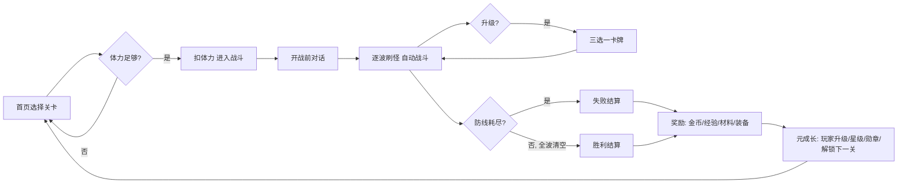
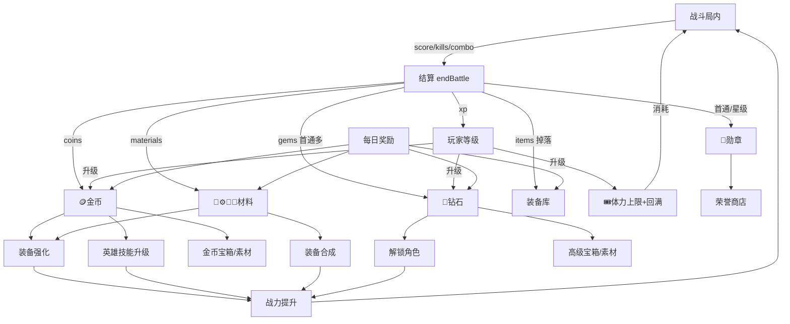

# 盗墓笔记·守陵防线 — 玩法与数值系统完整文档

> 文件来源：`minigames/haqi_linedefense.html`
> 用途：完整描述游戏玩法与全部数值系统，供后续数值体系合理性分析与数值模拟使用。
> 本文档为合并后的完整版，覆盖 §1~§56 全部章节。

---

## 0. 文档结构索引

| 模块 | 章节 | 内容 |
|------|------|------|
| 一、概述与世界规则 | §1~§4 | 游戏概述、核心循环、屏幕路由、6 系克制、关卡波次系统 |
| 二、难度与敌人数值 | §5~§10 | 难度曲线（关卡/波次复利）、敌人生成与精英/Boss 数值、困难模式、防线伤害、AABB |
| 三、英雄系统 | §11~§19 | 15 名角色完整技能/大招/属性、技能数值、形态进化、出战阵容、有效属性/战力 |
| 四、战斗内成长 | §20~§29 | 经验/升级三选一、连杀、过载、大招能量、13 种大招、召唤物、场地效果、局内奖励 |
| 五、装备与经济 | §30~§42 | 装备生成/稀有度/词条/强化/合成/掉落/商店/每日奖励 |
| 六、元成长系统 | §43~§51 | 玩家等级、体力、星级、勋章、关卡解锁、结算公式汇总 |
| 七、汇总与模拟 | §52~§56 | 全局数值表、关键公式、数值模拟建模建议、待验证平衡问题 |

---

## 1. 游戏概述

### 1.1 类型与题材

- **类型**：竖屏（9:19 固定比例）**塔防 / 车道防守（Lane Defense）**类游戏，融合了 Roguelike 的「战斗内三选一升级」与放置养成的「英雄+装备+经济」系统。
- **题材**：盗墓 / 古墓探险（“盗墓笔记”风格）。玩家带领盗墓小队，守住“长明灯防线”，挡住从墓道涌出的尸潮（粽子、浮尸、守墓兽）与 Boss。
- **技术形态**：单文件 HTML，纯 Canvas 2D 渲染 + Web Audio 程序化音效/BGM。无外部游戏引擎依赖（仅 TailwindCSS 用于 UI 层）。
- **美术资源**：英雄/敌人形象来自宠物精灵图库（`../famous-pets/_pet_index.json`），按 4×4 精灵表（行=形态、列=动画）绘制；背景使用 `art_assets` 古墓场景图。

### 1.2 核心目标

每一关由多个**波次（waves）**组成。敌人从屏幕**顶部车道**沿着车道向**底部防线**推进；英雄部署在防线附近自动开火攻击范围内的敌人。

- **胜利条件**：清空当前关卡的**所有波次**（最后一波刷完且场上敌人全部消灭）。
- **失败条件**：防线耐久（`baseHp`，又称“长明灯油量”）降到 0；或玩家主动“退出战斗”（判定为失败）。

### 1.3 核心循环（Core Loop）



**两层成长结构（核心数值理解要点）：**

1. **战斗内（局内）临时成长**：每局从“只有主角 1 人”开局，通过击杀累计经验 → 升级 → 三选一（招募候补/强化英雄/全队增益）。这些增益**仅本局有效**，下局清零。
2. **战斗外（局外）永久成长**：金币/钻石/勋章/材料/装备、英雄技能等级、玩家等级、关卡解锁、星级记录。这些永久保存到 `localStorage`（`SAVE_KEY = 'haqiLineDefenseSaveV3'`）。

---

## 2. 屏幕路由（Screen Router）

`G.screen` 控制当前界面，由 `show(screen)` 切换。战斗使用 Canvas，其余界面使用 DOM（`ui`）。

| screen | 界面 | 说明 |
|--------|------|------|
| `home` | 首页 / 战斗主页 | 选关、显示资源（体力/金币/钻石/勋章）、难度切换、底部导航 |
| `roster` | 伙伴 | 英雄更衣室（形态切换）、技能树升级、出战编队（拖拽出战/移出） |
| `shop` | 商店 | 宝箱/素材/荣誉兑换/角色解锁/钻石礼包 |
| `bag` | 背包 | 角色立绘+6 装备槽穿戴、装备库、强化/出售/合成、素材 |
| `map` | 地图 | 关卡节点图（zig-zag 路径），按进度逐关解锁 |
| `story` | 出击部署 | 章节剧情、首发主角、候补伙伴展示（保留界面，主流程经 home 进入） |
| `battle` | 战斗 | Canvas 主战斗循环 |

**资源货币（4 种 + 体力）：**

| 货币 | 符号 | 初始值 | 主要来源 | 主要用途 |
|------|------|--------|----------|----------|
| 金币 coins | 🪙 | 2200 | 战斗结算、宝箱保底、出售装备、玩家升级 | 装备强化、商店宝箱/素材、英雄技能升级 |
| 钻石 gems | 💎 | 1200 | 战斗（首通多）、玩家升级（每 5 级）、内购（演示） | 解锁角色、高级宝箱、素材兑换 |
| 勋章 medals | 🏅 | 0 | 首通（按星）、星级提升补发 | 荣誉商店兑换高价值物资 |
| 体力 energy | 🎟️ | 30（上限 30） | 按真实时间回复（每 3 分钟 +1）、玩家升级回满 | 进入战斗消耗（每关 `cost`） |
| （局内）战利 cash | 💚 | 0 | 仅战斗内显示统计，结算并入总 cash | 统计用途，无直接消耗 |

> 注：`G.coins` 初始 2200、`G.gems` 初始 1200，但首次进入会被 `loadProgress()` 覆盖（若有存档）。`startCash` 配置为 3000 但战斗内现金 `B.cash` 实际从 0 开始累计。

---

## 3. 六系元素克制系统

英雄与敌人均带 `element`（系别）。共 **6 系**，其中**自然系为平衡系**（无克制、无被克），其余 5 系构成**克制环**。

### 3.1 系别定义（`game_config.elements`）

| key | 名称 | 符号 | 颜色 | 克制（beats） | 特性 |
|-----|------|------|------|---------------|------|
| `nature` | 自然 | 🌿 | #2ecc71 | — | `balanced: true`，攻防无差别 |
| `fire` | 火 | 🔥 | #ff6b35 | ice（冰） | — |
| `ice` | 冰 | ❄️ | #5fd0ff | thunder（雷） | — |
| `thunder` | 雷 | ⚡ | #f1c40f | dark（暗） | — |
| `dark` | 暗 | 🌑 | #8e44ad | life（生命） | — |
| `life` | 生命 | 💗 | #e84393 | fire（火） | — |

### 3.2 克制环

```
火(fire) → 冰(ice) → 雷(thunder) → 暗(dark) → 生命(life) → 火(fire)
        克制         克制          克制         克制          克制
自然(nature)：独立于克制环，攻防均无差别。
```

### 3.3 克制伤害倍率（`elementMul(atkEl, defEl)`）

```js
elementBonus   = 1.75   // 克制时伤害倍率（攻击方克制防御方）
elementPenalty = 0.55   // 被克制时伤害倍率（防御方克制攻击方）
```

判定逻辑：

| 情形 | 倍率 |
|------|------|
| 攻击方或防御方任一为自然（balanced） | ×1.0 |
| 攻击方系别克制防御方系别 | ×1.75（克） |
| 防御方系别克制攻击方系别 | ×0.55（抗） |
| 其余（无克制关系） | ×1.0 |

> 数值含义：克制收益较高（+75%），被克惩罚较重（−45%），鼓励玩家针对敌人系别搭配阵容。元素淬炼三选一可让 `elementBonus` 进一步 +0.25/层。

### 3.4 敌人系别分配

敌人生成时**随机分配 6 系之一**（`randElement()`），与玩家阵容形成博弈。精英怪记录 `eliteElement`。已遭遇的怪物按系别记入“图鉴”（`B.seenEnemies`，战斗中“查看它们”按钮展示）。

---

## 4. 关卡与波次系统

### 4.1 关卡列表（`game_config.levels`，共 8 关）

每关字段：`id`、`name`、`diff`（难度文案）、`cost`（体力消耗）、`enemyHp`（基础敌人血量）、`enemySpeed`（基础敌人速度）、`spawnGap`（刷怪间隔 ms）、`restGap`（波次间隙 ms）、`bg`（背景图 id）、可选 `maxSquad`（本关出战上限）、`waves`（波次数组）。

| id | 名称 | diff | cost(🎟️) | enemyHp | enemySpeed | spawnGap | restGap | maxSquad | 波数 |
|----|------|------|-----------|---------|------------|----------|---------|----------|------|
| 1 | St.1-荒废校墓 | 简单 | 5 | 16 | 24 | 1300 | 2800 | 3 | 3 |
| 2 | St.2-古墓主殿 | 简单 | 5 | 22 | 28 | 1200 | 2700 | (5) | 4 |
| 3 | St.3-地下阴河 | 普通 | 8 | 30 | 32 | 1100 | 2500 | (5) | 5 |
| 4 | St.4-沙漠墓门 | 普通 | 10 | 42 | 34 | 1000 | 2400 | (5) | 5 |
| 5 | St.5-雪山铜门 | 困难 | 12 | 58 | 36 | 950 | 2300 | (5) | 6 |
| 6 | St.6-雨林沼墓 | 困难 | 14 | 78 | 38 | 900 | 2200 | (5) | 6 |
| 7 | St.7-沉船墓室 | 噩梦 | 16 | 104 | 40 | 850 | 2100 | (5) | 6 |
| 8 | St.8-矿井古墓 | 噩梦 | 18 | 140 | 42 | 800 | 2000 | (5) | 6 |

> `maxSquad` 仅第 1 关显式配置为 3，其余关回退到 `game_config.maxSquad = 5`（含主角，硬上限 5）。

### 4.2 波次（wave）属性

每个 wave 对象可含字段：

| 字段 | 含义 |
|------|------|
| `count` | 本波刷怪总数 |
| `boss: true` | Boss 波：先刷 `bossCount` 只 Boss，其余刷成围绕 Boss 的随从小怪 |
| `bossCount` | Boss 数量（缺省 1） |
| `swarm: true` | 冲锋潮：刷怪间隔减半（`swarmMul = 0.42`），密集涌出 |
| `elite: n` | 本波强制刷出 n 只精英怪 |
| `speedMul` | 本波敌人速度额外倍率 |
| `hpMul` | 本波敌人血量额外倍率 |
| `tag` | HUD 波次提示文案 |

### 4.3 各关波次明细（count / 修饰）

**St.1（共 30 怪）**
- W1: 10
- W2: 14 swarm「尸潮涌动」
- W3: 10 boss×1

**St.2（共 54 怪）**
- W1: 12
- W2: 16 elite2「精英先锋」
- W3: 14 swarm「尸潮涌动」
- W4: 12 boss×1

**St.3（共 80 怪）**
- W1: 14
- W2: 18 elite3「凶物集结」
- W3: 16 swarm speed×1.15「浮尸狂奔」
- W4: 14 boss×1
- W5: 18 boss×2「双煞降临」

**St.4（共 90 怪）**
- W1: 16 elite2
- W2: 20 swarm「黄沙突袭」
- W3: 18 hp×1.2「壮硕守墓兽」
- W4: 16 boss×1 + elite3
- W5: 20 boss×2「墓门守将」

**St.5（共 124 怪）**
- W1: 18 elite3
- W2: 22 swarm speed×1.2「寒潮压境」
- W3: 20 elite4「精英狂潮」
- W4: 18 boss×1
- W5: 22 hp×1.25「冰封凶物」
- W6: 24 boss×2 + elite2「铜门霸主」

**St.6（共 138 怪）**
- W1: 20 elite3
- W2: 24 swarm「毒瘴暴走」
- W3: 22 elite5 hp×1.15「变异凶物」
- W4: 20 boss×1 + elite2
- W5: 26 swarm speed×1.25「沼泽狂奔」
- W6: 26 boss×2 + elite3「腐化主宰」

**St.7（共 154 怪）**
- W1: 22 elite4
- W2: 28 swarm speed×1.2「暗舱洪流」
- W3: 24 elite6「水鬼军团」
- W4: 22 boss×2「双煞水鬼」
- W5: 28 hp×1.3 elite4「腐骨之群」
- W6: 30 boss×3 + elite4「深渊三煞」

**St.8（共 174 怪）**
- W1: 24 elite5
- W2: 30 swarm speed×1.3「矿道突袭」
- W3: 28 elite8 hp×1.2「终极凶物」
- W4: 24 boss×2 + elite4「墓室双王」
- W5: 32 swarm speed×1.35 hp×1.15「绝望尸潮」
- W6: 36 boss×3 + elite6「墓主降世」

### 4.4 波次流程与刷怪节奏

- **波内刷怪间隔**：`spawnTimer = spawnGap × (asBoss ? 1.2 : 0.55) × swarmMul`
  - 普通怪：`spawnGap × 0.55`（swarm 时再 ×0.42 ≈ `spawnGap × 0.231`）
  - Boss：`spawnGap × 1.2`
- **Boss 波逻辑**：先刷满 `bossCount` 只 Boss，剩余 `count − bossCount` 个名额刷成普通随从小怪。
- **精英分摊**：精英按概率平摊到本波刷怪中，确保刷满 `wave.elite` 只。
- **波次推进**：本波刷满 `count` 且场上敌人清空 → `waveIndex++`，进入 `restGap` 毫秒间隙后开下一波。
- **关卡通关**：`waveIndex >= waves.length` 且场上无敌人 → 胜利。

---

## 5. 全局难度曲线（`game_config.curve`）

游戏难度随**关卡序号**（`G.lvlIndex`，0-based）与**波次序号**（`B.waveIndex`，0-based）**双重指数式（复利）增长**，让敌人逐渐变强。

### 5.1 曲线参数

```js
curve: {
  stageHp: 0.26,          // 每推进一关，敌人血量额外 +26%（指数复利）
  stageSpd: 0.07,         // 每推进一关，敌人速度额外 +7%
  waveHp: 0.16,           // 每推进一波，敌人血量额外 +16%
  waveSpd: 0.035,         // 每推进一波，敌人速度额外 +3.5%
  eliteChanceBase: 0.06,  // 精英怪基础出现概率
  eliteChancePerStage: 0.025, // 每关精英概率增量
  eliteHpMul: 2.4,        // 精英血量倍率
  eliteDmgMul: 1.6,       // 精英破防伤害倍率
  bossHpMul: 18,          // Boss 血量倍率（相对同波杂兵）
  bossDmgMul: 2.2,        // Boss 破防伤害倍率
  bountyCurve: 0.12       // 击杀奖励随关卡增长
}
```

### 5.2 复利因子公式

| 因子 | 公式 | 含义 |
|------|------|------|
| `stageHpFactor()` | `(1 + 0.26) ^ G.lvlIndex` | 关卡 HP 复利 |
| `stageSpdFactor()` | `(1 + 0.07) ^ G.lvlIndex` | 关卡速度复利 |
| `waveHpFactor()` | `(1 + 0.16) ^ B.waveIndex` | 波次 HP 复利 |
| `waveSpdFactor()` | `(1 + 0.035) ^ B.waveIndex` | 波次速度复利 |
| `eliteChance()` | `0.06 + G.lvlIndex × 0.025` | 精英出现概率 |

**关卡 HP 复利示例**（`1.26^n`）：

| 关卡序号 lvlIndex | 0 | 1 | 2 | 3 | 4 | 5 | 6 | 7 |
|---|---|---|---|---|---|---|---|---|
| stageHpFactor | 1.000 | 1.260 | 1.588 | 2.000 | 2.520 | 3.176 | 4.002 | 5.042 |
| stageSpdFactor (1.07^n) | 1.000 | 1.070 | 1.145 | 1.225 | 1.311 | 1.403 | 1.501 | 1.606 |

**波次 HP 复利示例**（`1.16^n`）：

| 波次序号 waveIndex | 0 | 1 | 2 | 3 | 4 | 5 |
|---|---|---|---|---|---|---|
| waveHpFactor | 1.000 | 1.160 | 1.346 | 1.561 | 1.811 | 2.100 |
| waveSpdFactor (1.035^n) | 1.000 | 1.035 | 1.071 | 1.109 | 1.148 | 1.188 |

---

## 6. 敌人生成与数值链（`spawnEnemy`）

### 6.1 敌人主题（`game_config.enemies`，3 种杂兵）

| kind | 名称 | hpMul | spdMul | 形象（petId） |
|------|------|-------|--------|---------------|
| walker | 粽子 | 1.0 | 1.0 | shanhaijing_qiongqi_qiqi |
| runner | 浮尸 | 0.7 | 1.8 | shanhaijing_zheng_miaomiao |
| tank | 守墓兽 | 2.6 | 0.65 | shanhaijing_dangkang_kangkang |

**主题选择（`ti`）逻辑**（基于随机 roll 与关卡/波次进度）：
- 默认 `ti = 0`（粽子）
- `waveIndex >= 1` 且 `roll > 0.76` → `ti = 1`（浮尸）
- `waveIndex >= 2` 且 `roll > 0.88` → `ti = 2`（守墓兽）
- `lvlIndex >= 4` 且 `roll > 0.82` → `ti = min(2, ti+1)`（升级主题）

### 6.2 敌人 HP 完整计算链

```
hpCurve = stageHpFactor() × waveHpFactor() × (wave.hpMul || 1) × hardHp
hp = level.enemyHp × theme.hpMul × hpCurve
   × (isBoss ? bossHpMul(18) : (isElite ? eliteHpMul(2.4) : 1))
hp = round(hp)
```

其中：
- `level.enemyHp`：关卡基础血量（16~140）
- `theme.hpMul`：杂兵主题倍率（0.7/1.0/2.6）
- `hardHp`：困难模式 = 1.8，否则 1.0
- Boss 额外 ×18，精英额外 ×2.4

**普通粽子（walker, ti=0）基础 HP 示例（普通模式，第 1 波 waveIndex=0）：**

| 关卡 | enemyHp | stageHp | 实际 HP（≈ enemyHp×1×stageHp） |
|------|---------|---------|-------------------------------|
| St.1 | 16 | 1.000 | 16 |
| St.2 | 22 | 1.260 | 28 |
| St.3 | 30 | 1.588 | 48 |
| St.4 | 42 | 2.000 | 84 |
| St.5 | 58 | 2.520 | 146 |
| St.6 | 78 | 3.176 | 248 |
| St.7 | 104 | 4.002 | 416 |
| St.8 | 140 | 5.042 | 706 |

> 注意：基础 enemyHp 本身已逐关增长，再叠加 stageHp 复利 → **双重增长**。这是数值分析时需重点关注的“叠乘”点。

### 6.3 敌人速度完整计算链

```
spdCurve = stageSpdFactor() × waveSpdFactor() × (wave.speedMul || 1) × hardSpd
speed = level.enemySpeed × theme.spdMul × spdCurve × (isBoss ? 0.5 : 1)
```

- `hardSpd`：困难模式 = 1.25，否则 1.0
- Boss 速度额外 ×0.5（移动更慢，血厚）

### 6.4 精英怪（Elite）

| 属性 | 值 |
|------|-----|
| 出现概率 | `eliteChance() = 0.06 + lvlIndex × 0.025`（或被 `wave.elite` 强制） |
| HP 倍率 | ×2.4（`eliteHpMul`） |
| 破防伤害倍率 `dmgMul` | ×1.6（`eliteDmgMul`） |
| 体型 | ×1.22（`sizeMul`） |
| 视觉 | 脉冲光环 + ⭐标记 + “精英·{名}” |

### 6.5 Boss

| 属性 | 值 |
|------|-----|
| HP 倍率 | ×18（`bossHpMul`，相对同波杂兵 HP） |
| 破防伤害倍率 `dmgMul` | ×2.2（`bossDmgMul`） |
| 速度 | 同波杂兵 ×0.5 |
| 体型 | w=70, h=96（远大于杂兵 w≈30, h≈46） |
| 形态 | 随波次进化（`bossFormRow`），最后一波 boss = elder（终极形态） |
| 数量 | 受 `bossCount` 控制（1~3 只） |
| 名称 | 随机自 `bossNames`：千年墓主/青铜尸王/深渊阴煞/守陵凶兽 |
| 视觉 | 👑 王冠 + 形态名 + 触发屏幕震动 |

### 6.6 形态行（formRow）

精灵表行 = 形态（0=baby/form1 .. 3=elder/终极）。

- **杂兵**：`formRow = min(3, floor((waveIndex + lvlIndex) / 2))`
- **Boss**：`bossFormRow(waveIndex, totalWaves) = min(3, floor(waveIndex / (totalWaves-1) × 4))`
- 体型随形态略增：`× (1 + formRow × 0.06)`（Boss）/ 杂兵 `× (1 + formRow × 0.05)`

---

## 7. 困难模式（Hard Mode）

首页点击难度徽章在 **普通 / 困难（HARD）** 间切换（`G.hardMode`）。困难模式：

| 影响 | 普通 | 困难 |
|------|------|------|
| 敌人 HP（`hardHp`） | ×1.0 | ×1.8 |
| 敌人速度（`hardSpd`） | ×1.0 | ×1.25 |
| 视觉 | — | 跨场景 STOP 警戒封条 + ☠️ + 红色脉冲 |
| 奖励（`hardMul`，见 §38） | ×1.0 | ×1.6（金币/材料/装备稀有度加成） |

> 困难模式同时放大风险（敌人更强）与收益（奖励更高），是高玩刷材料/高稀有装备的途径。

---

## 8. 防线受击伤害（Enemy 抵达防线）

当敌人 `y >= laneBottom`（抵达防线）时，对防线造成伤害并自身消失（`dead`）：

```
基础破防伤害 = isBoss ? 25 : (ti===2 ? 12 : 6)
实际伤害 dmg = round(基础 × dmgMul)
```

其中 `dmgMul`：Boss=2.2，精英=1.6，普通=1.0。

**护盾优先吸收**：若 `B.shield > 0`，先吸收，剩余打防线 `baseHp`。

**各类敌人对防线的实际伤害：**

| 敌人类型 | 基础 | dmgMul | 实际伤害 |
|----------|------|--------|----------|
| 普通粽子/浮尸（ti 0/1） | 6 | 1.0 | 6 |
| 守墓兽（ti=2） | 12 | 1.0 | 12 |
| 精英（普通体型） | 6 | 1.6 | 10 |
| 精英（守墓兽 ti=2） | 12 | 1.6 | 19 |
| Boss | 25 | 2.2 | 55 |

> 防线初始耐久 `baseHpStart = 100`，可被装备 hp 词条提升上限（见 §18/§33）。Boss 单次破防 55，意味着 ~2 只 Boss 抵达即可击穿满血防线 → 凸显拦截 Boss 的重要性。

伤害发生时附带：屏幕震动（Boss=14，普通=6）、受击音效、`-N` 红色跳字。

---

## 9. 敌人 AABB 分离（防重叠堆叠）

`separateEnemies(sdt)` 防止敌人（尤其 Boss）精确叠在同一列：

- 允许重叠容差 `ALLOW_OVERLAP = 0.2`（两接触盒最多 20% 重叠）。
- 超出部分沿**最小穿透轴**互相推开（MTV）。
- **质量**：Boss `mass = 2.2`，普通 `mass = 1`（Boss 更难被推动）。
- **垂直分离特例**：只把靠后（y 较小）的怪往后顶，**绝不**把领先的怪拉回 → 避免领先 Boss 被后方小怪不断顶停。
- 推开后夹限在屏幕内（`W×0.06 ~ W×0.94`），且不被推回出生线之上太多。

> 此机制不直接影响伤害数值，但影响敌人**到达防线的时间分布**与**AOE 命中效率**，数值模拟时若考虑空间则需纳入。

---

## 10. 难度与敌人数值要点小结（供分析）

1. **HP 增长是“三重叠乘”**：`enemyHp（逐关递增）× stageHpFactor（1.26^关）× waveHpFactor（1.16^波）`，末关末波杂兵 HP 极高（St.8 W6 ≈ 706 × 2.10 ≈ 1483，再 ×2.6 守墓兽 ≈ 3855，Boss ×18 ≈ 数万级）。
2. **Boss HP ×18** 是关键挑战点：是否能拦下取决于英雄 DPS 的成长是否跟得上。
3. **困难模式 HP×1.8 + 速度×1.25** 叠加在已极高的曲线上，难度跳变明显。
4. **防线伤害固定**（6/12/55），不随关卡成长 → 后期“被破防的来源”主要是**漏怪数量**与**Boss 数量**，而非单体伤害提升。
5. **精英概率封顶**：St.8（lvlIndex=7）随机精英概率 = 0.06 + 7×0.025 = 0.235，叠加波次强制 elite。

---

## 11. 英雄系统总览

- 共 **15 名英雄**：前 5 名默认解锁（L1），后 10 名需消耗 💎 `unlockCost` 付费解锁。
- 形象使用宠物精灵图库（`petId`），4×4 精灵表（行=形态、列=动画）。
- 每名英雄含：`element`（系别）、`skill`（普通技能/自动开火）、`ult`（大招，仅作为“主角/领队”时可释放）、`stats`（基础属性 crit/phys）。
- **出战结构**：每局**只有主角 1 人开局**；候补（squad 中除主角外）通过战斗内三选一“招募”登场。

### 11.1 英雄属性基础字段（`stats`）

| 字段 | 含义 | 影响 |
|------|------|------|
| `crit` | 暴击率（%） | 命中时 `random×100 < crit` 触发暴击，伤害 ×1.6 |
| `phys` | 物理伤害（%） | 伤害乘子 `× (1 + phys/100)` |

> 还有装备词条 `hp`（防线耐久）与 `rate`（射速 %），通过装备注入（见 §18 有效属性）。

---

## 12. 默认解锁英雄（5 名，locked: false）

### 12.1 高城沙耶（saya）— 榴弹手 · 🔥火 · 主角默认 leader

| 项 | 值 |
|----|-----|
| 系别 | fire（火） |
| 技能「爆裂榴弹」 | type=flame, dmg=9, fireRate=900, speed=380, radius=50, burn=2.5, burnDmg=4 |
| 大招「火雨轰炸」 | type=meteor, dmg=60, count=14, burn=4, burnDmg=12 |
| 基础属性 | crit=10, phys=20 |

### 12.2 平野耕太（hirano）— 工程兵 · 🌑暗

| 项 | 值 |
|----|-----|
| 系别 | dark（暗） |
| 技能「麻痹钉枪」 | type=nail, dmg=7, fireRate=1100, speed=340, radius=60, slow=0.45 |
| 大招「死亡罗网」 | type=field, dmg=14, dur=4, stun=true |
| 基础属性 | crit=8, phys=14 |

### 12.3 宫本丽（rei）— 枪术能手 · ❄️冰

| 项 | 值 |
|----|-----|
| 系别 | ice（冰） |
| 技能「穿甲弹」 | type=pierce, dmg=11, fireRate=750, speed=520, pierce=4 |
| 大招「冰封天陆」 | type=freezeAll, dmg=30, dur=3.5, vuln=1.5 |
| 基础属性 | crit=12, phys=16 |

### 12.4 小室孝（takashi）— 队长 · ⚡雷

| 项 | 值 |
|----|-----|
| 系别 | thunder（雷） |
| 技能「雷链连射」 | type=chain, dmg=6, fireRate=360, speed=480, chain=2（**含全队伤害增益被动**） |
| 大招「冲锋号令」 | type=summonOverdrive, summonCount=2, overdrive=6 |
| 基础属性 | crit=6, phys=10 |
| 被动 | 在阵容中时全队伤害 ×(1 + 0.15×takashi.lvl)（见 §15 dmgBuff） |

### 12.5 鞠川静香（nurse）— 校医 · 🌿自然

| 项 | 值 |
|----|-----|
| 系别 | nature（自然，平衡） |
| 技能「治疗喷雾」 | type=support, dmg=0, fireRate=1500, speed=0, heal=4（每 tick 回防线，无伤害） |
| 大招「生命圣域」 | type=heal, heal=60, dur=6, regen=8, slowAll=0.5 |
| 基础属性 | crit=4, phys=6 |

---

## 13. 付费解锁英雄（10 名，locked: true）

| key | 名称 | 称号 | 系别 | unlockCost(💎) | 技能 | 大招 | crit/phys |
|-----|------|------|------|------|------|------|-----------|
| saeko | 毒岛冴子 | 剑道部长 | 💗life | 280 | 居合斩 pierce dmg14 rate520 spd620 pierce6 | 千本樱斩 blade dmg26 hits4 | 18/22 |
| kohta | 宫崎康太 | 重火力 | 🔥fire | 320 | 喷火扫射 rapid dmg5 rate220 spd540 burn1.8 burnDmg3 | 重机枪塔 summonTurret turretCount2 dur12 | 8/18 |
| shizuka | 小室美绪 | 爆破手 | ⚡thunder | 300 | 集束炸弹 explode dmg13 rate1100 spd360 radius72 | 地毯式轰炸 carpet dmg40 waves3 | 10/24 |
| alice | 麻枝由香 | 护理长 | 🌿nature | 260 | 治愈光环 support heal7 rate1100 | 广域护盾 shield heal50 shield60 dur8 | 4/8 |
| yuki | 雪村透 | 狙击手 | ❄️ice | 340 | 高爆狙击 pierce dmg22 rate980 spd760 pierce3 | 雷射风暴 snipe dmg70 shots10 | 22/20 |
| ryo | 天野辽 | 电击工 | ⚡thunder | 300 | 链式雷暴 chain dmg12 rate820 spd460 chain5 | 天劫雷域 thunderstorm dmg20 dur6 strikeGap0.35 | 12/14 |
| mai | 城崎舞 | 双枪手 | 🌑dark | 280 | 双枪扇射 normal dmg7 rate420 spd560 multishot3 spread0.2 | 弹幕狂欢 bullethell dmg12 bullets60 dur1.6 | 20/16 |
| ken | 黑木健 | 投弹兵 | ❄️ice | 320 | 霜爆弹 nail dmg14 rate1000 spd340 radius78 slow0.7 | 绝对零度 freezeTurret dmg24 dur4 turretCount1 dur10 | 12/22 |
| rika | 三崎里香 | 特警 | 🌿nature | 360 | 破甲弹链 pierce dmg16 rate700 spd640 pierce8 | 特勤突击 summonStrike summonCount3 dmg30 | 16/26 |
| hime | 白河姬 | 应援团长 | 💗life | 400 | 士气号召 support heal5 rate1300 | 决战应援 summonRally summonCount3 overdrive8 heal40 | 14/18 |

### 13.1 系别分布统计（用于配队博弈分析）

| 系别 | 英雄数 | 角色 |
|------|--------|------|
| fire 🔥 | 2 | saya, kohta |
| ice ❄️ | 3 | rei, yuki, ken |
| thunder ⚡ | 3 | takashi, shizuka, ryo |
| dark 🌑 | 2 | hirano, mai |
| life 💗 | 2 | saeko, hime |
| nature 🌿 | 3 | nurse, alice, rika |

---

## 14. 技能类型（type）行为汇总

| type | 行为 | 关键参数 |
|------|------|----------|
| flame | 命中爆炸 + 范围灼烧（DoT） | radius, burn, burnDmg |
| nail | 命中爆炸 + 减速 + 麻痹 | radius, slow |
| pierce | 贯穿多个敌人 | pierce（贯穿数） |
| chain | 命中后连锁闪电跳跃 | chain（跳数） |
| explode | 命中大范围爆炸（击退） | radius |
| rapid | 超高射速弹幕 + 灼烧 | fireRate 低, burn |
| support | 持续回复防线 + 减速光环（无伤害） | heal, fireRate |
| normal | 多重射击 | multishot, spread |

### 14.1 连锁闪电（chainLightning）

- 跳跃范围：`140px`（平方比较）。
- 每跳伤害衰减 ×0.78，造成感电（`shockT = 1.4s`，附加减速 ×0.7）。

### 14.2 灼烧 DoT（burn）

- 命中后 `burnT = burn` 秒、`burnDmg` 为每秒伤害。
- 每帧 `hurtRaw(e, burnDmg × sdt, '燃')`，DoT 跳字精简（50% 概率显示）。

---

## 15. 英雄伤害与开火数值

### 15.1 全队增益乘子

```
dmgBuff() = (takashi 在场 ? 1 + 0.15×takashi.lvl : 1) × (overdrive>0 ? 1.6 : 1)
rateBuff() = overdrive>0 ? 0.66 : 1   // 过载时射速间隔×0.66（更快）
```

### 15.2 单发伤害公式（`fire`）

```
phys = hero.eff.phys（含装备）
dmg = skill.dmg × (1 + (hero.lvl − 1) × 0.25) × dmgBuff × (1 + phys/100)
```

- **技能等级成长**：每级 +25% 基础伤害。
- **多重射击**：发射 `multishot` 发，扩散角 `spread`。

### 15.3 射速（开火间隔）公式（`heroFire`）

```
rateGear = 1 + (hero.eff.rate)/100          // 装备射速加成
rate(间隔ms) = skill.fireRate / (1 + (hero.lvl−1)×0.12) / rateGear × rateBuff()
```

- **技能等级成长**：每级 +12% 射速（间隔缩短）。

### 15.4 攻击半径（`skillRange`）

```
base = skill.range ?? 类型默认值
range = base × (1 + (hero.lvl − 1) × 0.04)   // 每级 +4% 射程
```

类型默认半径：

| type | 默认 range |
|------|-----------|
| support | 200 |
| rapid | 300 |
| nail | 300 |
| flame | 300 |
| normal | 320 |
| explode | 330 |
| chain | 340 |
| pierce | 420 |

> 英雄只攻击半径范围内的最近敌人（`nearestEnemyInRange`）。按住角色显示攻击半径圈。

### 15.5 暴击

```
若 random×100 < crit（含装备 crit）→ dmg ×1.6，标记暴击
```

### 15.6 单体理论 DPS 估算公式（供模拟）

```
单发期望伤害 ≈ skill.dmg × (1 + (lvl−1)×0.25) × dmgBuff × (1 + phys/100) × (1 + crit/100 × 0.6) × elementMul
每秒攻击次数 ≈ 1000 / rate(ms)
单体 DPS ≈ 单发期望伤害 × 每秒攻击次数 × (多重/贯穿/连锁等命中目标数)
```

> 注意：pierce/chain/explode/AOE 会命中多目标，实际“清场 DPS”需乘以平均命中目标数。

---

## 16. 形态进化（4 阶）

技能等级（`G.heroLevel[key]`）决定形态行（精灵表 row）：

| 形态 | 标签 | 解锁技能等级（FORM_THRESH） | formRow |
|------|------|------------------------------|---------|
| 形态一 | baby/form1 | Lv.1 | 0 |
| 形态二 | teen | Lv.3 | 1 |
| 形态三 | adult | Lv.5 | 2 |
| 终极形态 | elder | Lv.8 | 3 |

- 战斗内通过三选一“强化”跨过阈值 → 进化特效（终极形态金色光圈）。
- 越高形态：体型变大（`× (1 + formRow × 0.08)`）、光环更大、终极形态加金色脉冲圈。

---

## 17. 出战阵容规则

### 17.1 阵容结构

- `G.leader`：主角（固定出战，永远第一个开局，必须已解锁）。
- `G.squad`：出战候选池（含主角），最多 5 人（`maxSquad`）。候补 = squad 中除主角外的成员。

### 17.2 关卡出战上限（`levelSquadCap`）

```
HARD_CAP = 5
cap = clamp( level.maxSquad ?? game_config.maxSquad ?? 5, 1, 5 )
```

仅 St.1 配置 `maxSquad=3`，其余关 = 5。

### 17.3 关卡启动对齐（`fitSquadToLevel`）

开战时把出战阵容（含主角）对齐到 `cap` 人：
- **多了** → 裁剪末尾候补（主角永远保留）。
- **少了** → 自动补齐：优先“已解锁、未在阵容”的伙伴，其次任意未在阵容的伙伴。

### 17.4 候补登场（战斗内）

- 开局只有主角 1 人（`B.heroes = [leader]`）。
- `B.reserve` = squad 中除主角外的候选。
- 升级三选一可能出现“招募”卡 → `deployReserve(key)` 让候补登场（带登场台词冒泡）。

---

## 18. 有效属性与战力（`__ECON.effectiveStats` / `heroPower`）

### 18.1 有效属性（基础 + 装备）

```
基础（随技能等级成长）：
  phys = def.stats.phys + (lvl−1) × 4
  crit = def.stats.crit + (lvl−1) × 2
  hp   = 0
  rate = 0
+ 各装备槽 itemStats 累加（phys/crit/hp/rate）
```

> 注意：战斗内 `makeHeroUnit` 用的是 `effectiveStats`，所以技能等级越高、装备越好，单位越强。

### 18.2 英雄战力（`heroPower`）

```
heroPower = round(phys×12 + crit×8 + hp×4 + rate×6 + heroLevel×60)
```

### 18.3 阵容总战力（`squadPower`）

```
squadPower = Σ heroPower(主角 + 各候补)   // 去重
```

首页显示「⚡ 战力」。

---

## 19. 英雄系统数值要点小结（供分析）

1. **英雄伤害双重成长**：技能等级（每级 +25% dmg、+12% 射速、+4% 射程）+ 装备（phys/crit/rate 词条）。
2. **takashi 全队增益**为乘法叠加，作为候补/主角时对整队 DPS 影响显著。
3. **过载（overdrive）**：dmg×1.6 且射速×0.66（间隔），是局内爆发的关键短期 buff。
4. **support 角色无伤害**，价值在持续回防线 + 减速，需在 DPS 与续航间权衡。
5. **战力公式与实际 DPS 不直接等价**：战力是 UI 估值（含 heroLevel×60 的固定项），数值模拟应直接用 §15 的 DPS 公式而非战力。
6. **基础属性差异大**：rika（16/26）、saeko（18/22）、yuki（22/20）等付费角色明显强于默认角色（如 takashi 6/10、nurse 4/6）→ 付费角色强度倾斜需在平衡分析中关注。

---

## 20. 战斗内经验与升级（局内 Roguelike）

战斗内 `B.lvl` 与玩家永久等级 `G.playerLevel` **不同**，局内升级触发三选一卡牌。

### 20.1 经验来源（`gainXp`）

| 击杀目标 | 经验 |
|----------|------|
| Boss | 32 |
| 精英 | 14 |
| 普通 | 6 |

### 20.2 升级曲线（`xpNeed`）

```
初始 xpNeed = 12
升级后：grow = (lvl <= 3 ? 1.18 : 1.26)
        xpNeed = round(xpNeed × grow + 8)
```

前期升级更快（鼓励尽快拿到前几张卡）。升级曲线示例：

| 局内等级 lvl | 该级所需 xpNeed | 累计 |
|---|---|---|
| 1→2 | 12 | 12 |
| 2→3 | round(12×1.18+8)=22 | 34 |
| 3→4 | round(22×1.18+8)=34 | 68 |
| 4→5 | round(34×1.26+8)=51 | 119 |
| 5→6 | round(51×1.26+8)=72 | 191 |
| 6→7 | round(72×1.26+8)=99 | 290 |
| 7→8 | round(99×1.26+8)=133 | 423 |

> 注意：lvl=3→4 仍用 1.18（条件 `lvl<=3` 在升级**前**判断，lvl=3 时成立）。

---

## 21. 三选一卡牌（`openSkillSelect`）

升级时暂停游戏，弹出 3 张卡选 1。卡牌分三类：

### 21.1 卡牌类型

| kind | 含义 | 效果 |
|------|------|------|
| `recruit` | 招募候补 | 让一名候补登场（`deployReserve`） |
| `boost` | 强化已登场英雄 | 该英雄技能等级 +1（可触发形态进化） |
| 通用增益 | 8 种全局 buff | 见下表 |

### 21.2 卡牌生成逻辑

- 若有可招募候补：提供 1 张（有时 2 张，40% 概率且候补≥2）招募卡。
- 其余用已登场英雄的 boost 卡填充。
- 重复 boost（同英雄出现两次）被替换为通用增益。
- 不足 3 张用通用增益补齐。

### 21.3 8 种通用增益（`generic`）

| kind | 标签 | 效果 |
|------|------|------|
| dmg | 火力强化 | 全队 phys +18（改 hero.eff，不污染配置） |
| rate | 快速装填 | 全队等效 lvl +0.6（提升射速） |
| heal | 紧急补给 | 立即修复防线 +30 |
| maxhp | 加固防线 | 防线上限 +25 并回满该量 |
| crit | 精准瞄准 | 全队 crit +8 |
| overdrive | 战意爆发 | 立即过载狂暴 5 秒 |
| element | 元素淬炼 | `elementBonus` +0.25（克制伤害额外 +25%，**持久写入 config**） |
| lifesteal | 应急医疗 | 此后击杀回复防线 +1（Boss ×5） |

> ⚠️ 数值分析注意：`element` 卡修改的是全局 `game_config.elementBonus`，**跨局累积**（未在局间重置），属于潜在的“滚雪球/数值污染”点。

---

## 22. 连杀系统（Combo）

```
每次击杀：combo++, comboTimer = 2.2s（窗口内未击杀则归零）
comboMul = 1 + min(2, combo × 0.04)   // 分数加成，最高 +200%
comboBest 记录本局最高连杀
```

### 22.1 连杀里程碑

| combo | 效果 |
|-------|------|
| 10 / 25 / 50 / 100 | 提示 + 震动 + 连杀音效 |
| ≥25 | 触发**全队过载** 4 秒（`overdrive = max(overdrive, 4)`） |

> 连杀越高 → 分数越高 → 结算金币/经验/勋章越多（间接经济收益），且 25 连杀自动触发过载形成正反馈。

---

## 23. 过载狂暴（Overdrive）

- 触发：连杀≥25、`overdrive` 卡、部分大招（summonOverdrive/summonRally）。
- 效果：`dmgBuff × 1.6`（伤害 +60%）+ `rateBuff = 0.66`（射速间隔 ×0.66）。
- 视觉：红色脉冲全屏叠加。
- 计时随时间衰减。

**过载期间总输出乘子 ≈ 1.6（伤害）× 1/0.66（射速）≈ 2.42 倍 DPS。**

---

## 24. 大招能量系统（`game_config.ult`）

```js
ult: {
  energyMax: 100,    // 满能量阈值
  gainPerKill: 6,    // 击杀普通敌人
  gainPerElite: 14,  // 击杀精英
  gainPerBoss: 40,   // 击杀 Boss
  gainPerHit: 0.4,   // 每次命中
  startEnergy: 30    // 开局初始能量
}
```

### 24.1 能量积攒（`gainEnergy`）

- 命中：+0.4
- 击杀普通：+6 / 精英：+14 / Boss：+40
- 满能量时提示“大招就绪!” + 震动 + 音效。

### 24.2 释放（`castUltimate`）

- 仅**领队（主角）**的大招可释放，需能量满。
- 释放后能量清零，演出：闪白 0.5 + 震动 16 + 子弹时间（slowmo 0.5，时间流速 ×0.35）。
- 大招伤害随领队等级成长：`D2(v) = v × (1 + phys/100) × (1 + (lvl−1) × 0.12)`。

---

## 25. 13 种大招效果（`ult.type`）

| type | 名称示例 | 行为 | 关键参数 |
|------|----------|------|----------|
| meteor | 火雨轰炸 | count 处随机落点爆炸（radius 60）+ 点燃全场命中 | dmg, count, burn, burnDmg |
| field | 死亡罗网 | 全场雷区，每 0.4s 伤害+麻痹，持续 dur | dmg, dur, stun |
| freezeAll | 冰封天陆 | 全体冻结 dur + 脆弱（vuln 受伤放大）+ 即时伤害 | dmg, dur, vuln |
| heal | 生命圣域 | 立即回血 + 持续场效（regen 每 0.5s、全场减速） | heal, dur, regen, slowAll |
| shield | 广域护盾 | 回血 + 护盾值 + 护盾光环 | heal, shield, dur |
| blade | 千本樱斩 | hits 段全场穿透伤害 | dmg, hits |
| snipe | 雷射风暴 | shots 发锁定高血量目标（优先 Boss/精英） | dmg, shots |
| carpet | 地毯式轰炸 | waves 波全场连环爆炸（每波 8 点） | dmg, waves |
| thunderstorm | 天劫雷域 | 持续随机雷击（每 strikeGap 秒）+ 连锁 | dmg, dur, strikeGap |
| bullethell | 弹幕狂欢 | 原地泼洒 bullets 发子弹 | dmg, bullets, dur |
| summonOverdrive | 冲锋号令 | 召唤 summonCount 民兵 + 过载 overdrive 秒 | summonCount, overdrive |
| summonTurret | 重机枪塔 | 召唤 turretCount 炮塔（dur 秒） | turretCount, turretDur |
| freezeTurret | 绝对零度 | 全体冻结 + 冰霜哨塔 | dmg, dur, turretCount, turretDur |
| summonStrike | 特勤突击 | 召唤民兵 + 全场穿透伤害 | summonCount, dmg |
| summonRally | 决战应援 | 召唤民兵 + 全队过载 + 回血 | summonCount, overdrive, heal |

### 25.1 freezeAll 脆弱（vuln）

```
若 e.frozenT > 0：受到伤害 × vuln（如 1.5）
```

冰封期间是集火 Boss 的窗口。

---

## 26. 召唤物（`game_config.summon`）

```js
summon: {
  minionHp: 40, minionDmg: 8, minionRate: 700, minionDur: 12, minionRange: 220,
  turretDmg: 14, turretRate: 480, turretRange: 320
}
```

| 类型 | HP | 单发伤害 | 攻速(ms) | 射程 | 持续(s) | 备注 |
|------|-----|----------|----------|------|---------|------|
| 民兵 minion | 40 | 8 | 700 | 220 | 12 | 用领队宠物形象，普通弹 |
| 炮塔 turret | — | 14 | 480 | 320 | dur（10~12） | 贯穿弹（pierce 2），更快更远 |

- 自动攻击范围内最近敌人。
- 民兵 DPS ≈ 8 × (1000/700) ≈ 11.4；炮塔 DPS ≈ 14 × (1000/480) × 2(贯穿) ≈ 58.3（理论，命中 2 目标）。
- ice 炮塔附带减速（slow 0.5）。

---

## 27. 持续场地效果（`B.fields`）

| kind | 来源大招 | 效果 |
|------|----------|------|
| field | field（死亡罗网） | 每 0.4s 对全场伤害 `dmg×0.4`，可附麻痹 0.6s |
| sanctuary | heal（生命圣域） | 每 0.5s 回防线 `regen×0.5`，全场减速 |
| storm | thunderstorm（天劫雷域） | 每 gap 秒随机雷击 1 目标（dmg + 连锁 2 跳 ×0.6） |
| shieldglow | shield（广域护盾） | 视觉护盾光环，持续 dur |

---

## 28. 局内击杀奖励（`killEnemy`，结算前的局内累计）

```
comboMul = 1 + min(2, combo × 0.04)
bountyMul = 1 + lvlIndex × bountyCurve(0.12)
baseScore = Boss 200 / 精英 60 / 守墓兽(ti=2) 30 / 其他 10
baseCash  = Boss 120 / 精英 28 / 其他 8
B.score += round(baseScore × comboMul)
B.cash  += round(baseCash × bountyMul)
```

- `B.score`（⭐分数）：决定结算金币/经验/勋章（见 §38/§48）。
- `B.cash`（💚现金）：局内统计，结算并入 `G.cash`（无直接消耗用途）。
- 灼烧致死 / 减速等不改变击杀奖励基数。

### 28.1 局内分数与结算的关系（概览，详见 §38/§48）

```
结算金币 baseCoin = (win?120:30) + round(score/4) + round(comboBest×2) + kills×2
玩家经验 xpGain   = round(score/3 + (win?40:8) + comboBest×1.2 + (firstClear?60:0))
```

> 分数（score）是连接“局内表现”与“局外经济/成长”的核心枢纽变量。

---

## 29. 战斗内成长数值要点小结（供分析）

1. **正反馈链**：击杀 → 连杀 → 25 连触发过载（DPS×2.42）→ 击杀更快 → 更高连杀 + 大招能量更快满 → 大招清场 → 连杀延续。需评估是否过强（滚雪球）。
2. **大招能量满速度**：靠击杀（普通 +6/精英 +14/Boss +40）+ 命中（+0.4）。Boss 波击杀大量随从可快速攒满，正好打 Boss。
3. **三选一权重**：招募卡优先出现，保证候补登场；但通用增益（尤其 element 永久 +0.25）可能造成跨局滚雪球。
4. **召唤/炮塔 DPS** 是大招型角色的持续输出来源，需纳入“清场 DPS”模拟。
5. **过载叠加大招**：summonRally（过载 8s）+ 25 连杀过载可叠时长，爆发期 DPS 极高。
6. **score → 经济** 的换算系数（/4 金币、/3 经验）是局外成长速率的关键旋钮。

---

## 30. 装备系统总览（`window.__ECON`）

- **6 个装备槽**，每槽有主属性（mainStat）。
- **5 档稀有度**（普通→传说），决定属性倍率、词条数、强化上限、售价。
- **4 种属性词条**：phys / crit / hp / rate。
- 装备实例存于 `G.inventory`，穿戴记录于 `G.equipped[heroKey][slot]`。

### 30.1 装备槽（`ECON.slots`）

| key | 名称 | 符号 | 主属性 mainStat |
|-----|------|------|------------------|
| helmet | 头盔 | 🪖 | hp |
| armor | 护甲 | 🦺 | hp |
| legs | 护腿 | 👖 | phys |
| boots | 战靴 | 🥾 | rate |
| gloves | 手套 | 🧤 | crit |
| badge | 徽章 | 🎖️ | phys |

### 30.2 属性词条（`ECON.statInfo`）

| key | 名称 | 符号 | base 基础值 | 后缀 |
|-----|------|------|-------------|------|
| phys | 物理伤害 | ⚔️ | 6 | % |
| crit | 暴击率 | 🎯 | 4 | % |
| hp | 防线耐久 | 🛡️ | 8 | （无） |
| rate | 射速 | ⚡ | 5 | % |

---

## 31. 稀有度（`ECON.rarities`，5 档）

| r | key | 名称 | 颜色 | mul 属性倍率 | affixes 词条数 | maxLvl 强化上限 | sellCoin 基础售价 | sellMatBonus |
|---|-----|------|------|--------------|----------------|------------------|-------------------|--------------|
| 1 | common | 普通 | #9aa0a6 | 1.0 | 1 | 5 | 60 | 0 |
| 2 | fine | 精良 | #3fce6a | 1.35 | 1 | 8 | 140 | 1 |
| 3 | rare | 稀有 | #4aa3ff | 1.8 | 2 | 12 | 320 | 2 |
| 4 | epic | 史诗 | #b06bff | 2.45 | 3 | 16 | 760 | 4 |
| 5 | legendary | 传说 | #ffb733 | 3.4 | 4 | 20 | 1800 | 8 |

> `affixes` = 总词条数（含主属性占 1 条）。即普通仅主属性；传说 = 主属性 + 3 副词条。

---

## 32. 装备实例生成（`makeItem(slot, rarity, opt)`）

### 32.1 主属性

```
mainKey = slot.mainStat
mainVal = round(statInfo[mainKey].base × rarity.mul)
```

**各稀有度主属性值（按 mainStat 的 base）：**

| 主属性 base | 普通(×1.0) | 精良(×1.35) | 稀有(×1.8) | 史诗(×2.45) | 传说(×3.4) |
|-------------|-----------|-------------|-----------|-------------|-----------|
| hp(8) | 8 | 11 | 14 | 20 | 27 |
| phys(6) | 6 | 8 | 11 | 15 | 20 |
| crit(4) | 4 | 5 | 7 | 10 | 14 |
| rate(5) | 5 | 7 | 9 | 12 | 17 |

### 32.2 副词条

```
affixCount = rarity.affixes − 1   // 主属性占 1
每条：随机 statKey；v = round(statInfo[k].base × rarity.mul × (0.4 ~ 0.9))  // 含随机系数 0.4+rand×0.5
v = max(1, v)
```

> 副词条种类可重复，数值带 0.4~0.9 随机区间。

### 32.3 装备模板（外观）

每槽有若干 base 模板（仅影响名称/emoji，不影响数值）：headers 见 `ECON.bases`（如头盔：钢制头盔/青铜面甲/玉冠）。

---

## 33. 装备属性计算

### 33.1 单件属性（含强化，`itemStats`）

```
lvlMul = 1 + item.level × enhancePerLevel(0.12)
out[mainKey] += main.v × lvlMul
each affix:  out[k] += affix.v × lvlMul
（各项 round）
```

> **强化每级 +12% 该件白值**（主+副均放大）。

### 33.2 单件战力（`itemPower`）

```
itemPower = round(phys×3 + crit×4 + hp×1.5 + rate×3 + rarity×20)
```

---

## 34. 强化（Enhance）

### 34.1 花费（`enhanceCost`）

```
coin = round( enhanceCoinBase(80) × (level+1)^1.35 × (0.6 + rarity.r × 0.35) )
材料 need：
  screw = enhanceMatBase(1) + floor(level/2) + rarity.r
  if level>=4:  gear   = 1 + floor((level−4)/3)
  if level>=8:  potion = 1 + floor((level−8)/4)
  if level>=14 && rarity.r>=4: crystal = 1 + floor((level−14)/5)
```

**金币花费示例（稀有 r=3，倍率 0.6+3×0.35=1.65）：**

| 当前 level→ | +1 | +2 | +3 | +5 | +8 | +12 |
|---|---|---|---|---|---|---|
| (level+1)^1.35 | 1 | 2.55 | 4.41 | 8.95 | 16.55 | 32.4 |
| coin ≈ | 132 | 336 | 582 | 1181 | 2185 | 4277 |

> 强化花费随等级以 `^1.35` 增长，并随稀有度线性放大。高稀有 + 高等级强化金币与高级材料需求陡增。

### 34.2 强化判定（`canEnhance`）

- 已达 `rarity.maxLvl` → 不可。
- 金币不足 / 材料不足 → 不可。

---

## 35. 合成（Fuse）

```
fuseNeed = 3   // 3 件同稀有度 → 1 件高一档（随机槽位）
材料消耗：gear × rarity.r
限制：传说(r=5) 不可再合成
```

- 选 3 件**相同稀有度**装备，消耗 `gear × r` → 产出高一档随机槽位装备。
- 被合成装备先卸下再移除。

---

## 36. 出售（Sell）

```
coin = round( rarity.sellCoin × (1 + item.level × 0.15) )   // 强化等级返还 15%/级
若 rarity.sellMatBonus > 0：返还 gear × sellMatBonus
```

---

## 37. 材料（`ECON.mats`）

| key | 名称 | 符号 | 用途 |
|-----|------|------|------|
| screw | 螺丝 | 🔩 | 低级强化 |
| gear | 齿轮 | ⚙️ | 中级强化 / 合成 / 出售返还 |
| potion | 强化液 | 🧪 | 高级强化（level≥8） |
| crystal | 结晶 | 💠 | 顶级强化（level≥14 且 r≥4） |

---

## 38. 战斗掉落（`rollBattleRewards(stageIdx, win, opt)`）

opt 含：score, comboBest, kills, hard, firstClear。

### 38.1 金币

```
stageMul = 1 + stageIdx × 0.28
hardMul = hard ? 1.6 : 1
baseCoin = (win?120:30) + round(score/4) + round(comboBest×2) + kills×2
coins = round(baseCoin × stageMul × hardMul)
```

### 38.2 材料

```
matRoll = (win?1:0.4) × (1 + stageIdx×0.15) × hardMul
screw  = round((2 + rand×4) × matRoll)
gear   = (rand < 0.5 + stageIdx×0.05) ? round((1 + rand×2) × matRoll) : 0
potion = (win && stageIdx>=2 && rand<0.4) ? 1~2 : 0
crystal= (win && stageIdx>=4 && rand<0.25) ? 1 : 0
```

### 38.3 钻石

```
win ? (firstClear ? 15 + stageIdx×5 : 6) : 0
```

### 38.4 装备掉落

```
win：必掉 1 件；若 comboBest>=30 且 rand<0.5 额外 +1 件
lose：rand<0.35 掉 1 件
```

### 38.5 装备稀有度权重（`rollDropItem(stageIdx, hard)`）

```
t = min(1, stageIdx/7)
权重 w:
  common    = max(2, 50 − t×45)
  fine      = 30 + t×5
  rare      = 12 + t×22
  epic      = 4 + t×14
  legendary = 1 + t×9 + (hard ? 4 : 0)
按权重抽稀有度，槽位随机
```

**稀有度权重示例（普通模式）：**

| stageIdx | t | common | fine | rare | epic | legendary |
|----------|---|--------|------|------|------|-----------|
| 0 (St.1) | 0 | 50 | 30 | 12 | 4 | 1 |
| 3 (St.4) | 0.43 | 30.6 | 32.1 | 21.4 | 10 | 4.9 |
| 7 (St.8) | 1.0 | 5 | 35 | 34 | 18 | 10 |

> 后期关卡（含困难模式 +4 传说权重）显著提升高稀有装备掉率。

---

## 39. 商店（Shop）

### 39.1 宝箱（`CHESTS`）

| id | 名称 | 货币 | 价格 | count | minRarity 保底 | stageBoost 等效关卡偏移 |
|----|------|------|------|-------|----------------|--------------------------|
| wood | 木质宝箱 | 🪙 | 800 | 1 | 1 | 0 |
| iron | 青铜宝箱 | 🪙 | 2400 | 1 | 2 | 2 |
| gold | 鎏金宝箱 | 💎 | 60 | 1 | 3 | 4 |
| relic | 明器宝箱 | 💎 | 180 | 3 | 3 | 6 |
| epicc | 史诗宝箱 | 💎 | 320 | 1 | 4 | 7 |

> 宝箱走 `rollDropItem(lvlIndex + stageBoost)`，若结果稀有度低于 minRarity 则提升到 minRarity。

### 39.2 素材兑换（`MAT_GOODS`）

| id | 材料×数量 | 货币 | 价格 |
|----|-----------|------|------|
| m_screw | 螺丝×20 | 🪙 | 400 |
| m_gear | 齿轮×10 | 🪙 | 1200 |
| m_pot | 强化液×5 | 🪙 | 2000 |
| m_pot2 | 强化液×12 | 💎 | 80 |
| m_cry | 结晶×3 | 💎 | 120 |
| m_cry2 | 结晶×8 | 💎 | 280 |

### 39.3 荣誉兑换（`HONOR_GOODS`，货币=🏅 勋章）

| id | 内容 | 价格(🏅) |
|----|------|----------|
| hn_coin | 金币×3000 | 200 |
| hn_pot | 强化液×10 | 300 |
| hn_cry | 结晶×6 | 500 |
| hn_chest | 荣誉宝箱（保底史诗 minRarity4 boost8） | 800 |
| hn_gem | 钻石×100 | 600 |

### 39.4 角色解锁（`renderHeroTab`）

付费角色用 💎 `unlockCost`（260~400）解锁，见 §13。

### 39.5 钻石礼包（`GEM_PACKS`，内购演示，实际不可购买）

60/300/680/1280/3280/6480 钻石，对应 ¥6~¥648（演示用途，点击提示“暂未开放”）。

---

## 40. 每日奖励（`dailyList`，按本地日期去重）

| id | 名称 | 内容 |
|----|------|------|
| d_coin | 每日金币 | 🪙×600 |
| d_screw | 补给箱 | 🔩×15 |
| d_gear | 齿轮包 | ⚙️×6 |
| d_gem | 每日钻石 | 💎×30 |
| d_chest | 免费宝箱 | 随机装备×1（`rollDropItem(lvlIndex+1)`） |

- 每日 0 点刷新；首页 📅 按钮，有可领取项显示红点；支持“一键领取全部”。

---

## 41. 启动装备（`seedStarterGear`，仅首次背包为空时）

发 2 件普通（头盔/护甲）+ 1 件精良（手套），并自动给主角穿上。

---

## 42. 装备与经济数值要点小结（供分析）

1. **强化是金币/材料的主要 sink**：`^1.35` 金币曲线 + 分级材料（screw/gear/potion/crystal）形成多层消耗。
2. **掉落金币与 score 强相关**（`score/4`），与 kills、comboBest 线性挂钩 → 局内表现直接决定经济产出。
3. **困难模式**：金币 ×1.6、材料 ×1.6、传说权重 +4 → 高风险高回报的刷资源路径。
4. **稀有度倍率跨度大**（1.0→3.4），传说装备属性约为普通的 3.4 倍且多 3 条词条 → 装备成长空间巨大。
5. **合成（3 合 1 升档）+ 宝箱保底** 提供稳定的稀有度提升路径，消耗 gear。
6. **经济闭环**：战斗产出（金币/材料/装备/勋章/钻石）→ 强化/合成/解锁/商店 → 战力提升 → 通关更高关 → 更高产出。需评估各 sink/faucet 是否平衡。

---

## 43. 玩家等级与经验（`PROG` / `gainPlayerXp`）

玩家永久等级 `G.playerLevel`（区别于战斗内 `B.lvl`）。

### 43.1 升级曲线

```js
PROG.maxPlayerLevel = 60
playerXpNeed(level) = round( 100 × level^1.4 )
```

**升级所需经验示例：**

| level | level^1.4 | xpNeed |
|-------|-----------|--------|
| 1 | 1.00 | 100 |
| 2 | 2.64 | 264 |
| 3 | 4.66 | 466 |
| 5 | 9.52 | 952 |
| 10 | 25.12 | 2512 |
| 20 | 66.29 | 6629 |
| 30 | 116.9 | 11687 |
| 60 | 309.0 | 30899 |

### 43.2 升级奖励（`gainPlayerXp`）

每升一级：
```
energyMax += energyPerLevel(2)   // 体力上限 +2
energy = energyMax               // 回满体力
gainCoins += 200 + playerLevel × 30
若 playerLevel % 5 == 0：gainGems += 30
```

> 玩家等级越高，体力上限越高（更多次出战），并发放金币/钻石。

---

## 44. 体力系统（Stamina）

```js
PROG.energyRegenSec = 180   // 每 180 秒（3 分钟）回复 1 点
PROG.energyPerLevel = 2     // 玩家每升 1 级，上限 +2
energyMax 初始 = 30
```

### 44.1 按真实时间结算（`refreshEnergy`）

- 依据 `energyTs`（上次结算时间戳）与当前时间差，每满 180 秒 +1，封顶 `energyMax`。
- 满体力时 `energyTs` 归零计时。

### 44.2 消耗（`spendEnergy`）

- 进入战斗扣 `level.cost`（5~18，见 §4.1）。
- 体力不足时提示“约 mm:ss 后回复”，无法开战。

### 44.3 体力经济分析点

- 满体力 30，从满到空可打：St.1（cost5）≈6 次，St.8（cost18）≈1 次。
- 回复 1 点需 3 分钟 → 回满 30 点需 90 分钟（约 1.5 小时）。
- 玩家等级提升体力上限（+2/级），是延长单次会话时长的旋钮。

---

## 45. 星级评价（`computeStars`）

```
win 时，按防线剩余百分比 barrierPct：
  barrierPct >= 80 → 3 星
  barrierPct >= 40 → 2 星
  否则             → 1 星
lose → 0 星
```

- 取**历史最佳**（`G.stars[levelId]`）。
- 总星数 `totalStars()` / 满星 `maxStars() = 关卡数 × 3 = 24`。

---

## 46. 勋章（Medals，🏅）

结算时按通关/星级发放（`endBattle`）：

```
firstClear（首通）: medalGain = bestStars × 100 + 100
非首通但 improved（星级提升）: medalGain = (bestStars − prevStars) × 60
```

> 勋章只能通过通关/三星获得，是“成就型硬通货”，用于荣誉商店兑换高价值物资（§39.3）。

---

## 47. 关卡解锁（`isLevelUnlocked`）

```
第 1 关恒解锁；
其余关：上一关已通关（G.cleared[prevId]）才解锁
```

地图 / 首页对未解锁关显示 🔒，无法开战。

---

## 48. 结算全流程（`endBattle(win)`）公式汇总

这是连接“局内表现”与“局外永久成长”的核心函数。

### 48.1 防线剩余与油量

```
barrierPct = max(0, round(B.baseHp / B.baseHpMax × 100))
G.barrierHp = win ? max(barrierPct, 1) : 0   // 失败=油尽(0)
```

### 48.2 星级与通关记录

```
firstClear = win && !G.cleared[lvId]
res = recordResult(lvId, win, B.score, barrierPct)  // 更新 cleared/stars/bestScore
```

### 48.3 经济奖励（调用 `rollBattleRewards`，见 §38）

```
rw = rollBattleRewards(lvlIndex, win, {score, comboBest, kills, hard, firstClear})
G.coins += rw.coins
G.gems  += rw.gems
G.cash  += B.cash
各材料 += rw.mats
各装备 → addItem(rw.items)
```

### 48.4 勋章

```
firstClear: medalGain = bestStars×100 + 100
improved:   medalGain = (bestStars − prevStars) × 60
G.medals += medalGain
```

### 48.5 玩家经验

```
xpGain = round( B.score/3 + (win?40:8) + B.comboBest×1.2 + (firstClear?60:0) )
gainPlayerXp(xpGain)   // 可能触发玩家升级（体力上限+2、回满、金币/钻石）
```

### 48.6 统计

```
G.totalEarned += rw.coins
G.totalRuns   += 1
```

---

## 49. 英雄技能升级成本（局外，`roster` 界面）

```
upCost(lvl) = lvl × 120   // 升到下一级需金币 = 当前等级 × 120
```

| 当前等级 lvl | 升级金币 |
|---|---|
| 1→2 | 120 |
| 2→3 | 240 |
| 3→4 | 360 |
| 5→6 | 600 |
| 7→8 | 840 |

- 技能等级影响：单发伤害（+25%/级）、射速（+12%/级）、射程（+4%/级）、形态进化（Lv 3/5/8）、有效属性（phys +4/级、crit +2/级）。
- 付费角色解锁成本 `unlockCost`（💎 260~400）。

---

## 50. 完整成长/经济流向图



---

## 51. 元成长系统数值要点小结（供分析）

1. **三条经验/等级体系并存**：局内 `B.lvl`（三选一）、玩家 `G.playerLevel`（XP^1.4）、英雄技能等级（金币 lvl×120）。需分别建模。
2. **体力门控出战频率**：每 3 分钟回 1 点，satisfies 节奏控制；玩家升级 +2 上限缓解门控。
3. **星级门控勋章产出**：3 星需防线≥80%，奖励首通 ×100/星 + 100，鼓励高质量通关。
4. **金币双向来源**：战斗结算 + 玩家升级；sink 为强化/技能升级/宝箱。需平衡产出 vs 消耗。
5. **score 是核心枢纽**：决定金币（/4）、经验（/3），且 score 受 combo 加成（最高 ×3）→ 局内表现放大局外收益。
6. **关卡线性解锁** + 体力 cost 递增（5→18）→ 后期推进对体力与战力双重要求提高。

---

## 52. 全局常量速查表

### 52.1 基础经济

| 变量 | 值 | 说明 |
|------|-----|------|
| 初始 coins | 2200 | 金币 |
| 初始 gems | 1200 | 钻石 |
| 初始 medals | 0 | 勋章 |
| 初始 energy / energyMax | 30 / 30 | 体力 |
| baseHpStart | 100 | 防线初始耐久 |
| maxSquad | 5 | 出战上限（含主角） |

### 52.2 元素

| 变量 | 值 |
|------|-----|
| elementBonus（克制） | 1.75 |
| elementPenalty（被克） | 0.55 |
| 暴击伤害倍率 | 1.6 |

### 52.3 难度曲线

| 变量 | 值 |
|------|-----|
| stageHp / stageSpd | +0.26 / +0.07（每关复利） |
| waveHp / waveSpd | +0.16 / +0.035（每波复利） |
| eliteChanceBase / perStage | 0.06 / +0.025 |
| eliteHpMul / eliteDmgMul | 2.4 / 1.6 |
| bossHpMul / bossDmgMul | 18 / 2.2 |
| bountyCurve | 0.12 |
| 困难 hardHp / hardSpd / 奖励 hardMul | 1.8 / 1.25 / 1.6 |

### 52.4 大招能量 / 召唤

| 变量 | 值 |
|------|-----|
| energyMax | 100 |
| gainPerKill / Elite / Boss / Hit | 6 / 14 / 40 / 0.4 |
| startEnergy | 30 |
| minion HP/DMG/Rate/Dur/Range | 40 / 8 / 700 / 12 / 220 |
| turret DMG/Rate/Range | 14 / 480 / 320 |

### 52.5 成长曲线

| 公式 | 表达式 |
|------|--------|
| 玩家 XP 需求 | `round(100 × level^1.4)` |
| 体力回复 | 1 点 / 180 秒 |
| 体力上限增长 | +2 / 玩家等级 |
| 英雄技能升级金币 | `lvl × 120` |
| 装备强化金币 | `round(80 × (lvl+1)^1.35 × (0.6 + r×0.35))` |
| 装备强化每级属性增幅 | +12% 白值 |
| 局内升级 XP | 初始 12，grow=1.18(lvl≤3)/1.26，`round(xpNeed×grow+8)` |

---

## 53. 关键战斗公式汇总（模拟用）

### 53.1 敌人 HP / 速度

```
hp = round( level.enemyHp × theme.hpMul × stageHpF × waveHpF × waveHpMul × hardHp
            × (boss?18 : elite?2.4 : 1) )
spd = level.enemySpeed × theme.spdMul × stageSpdF × waveSpdF × waveSpdMul × hardSpd × (boss?0.5:1)
stageHpF=1.26^lvlIndex, waveHpF=1.16^waveIndex
stageSpdF=1.07^lvlIndex, waveSpdF=1.035^waveIndex
```

### 53.2 英雄单发伤害 / 射速

```
单发 = skill.dmg × (1 + (lvl−1)×0.25) × dmgBuff × (1 + phys/100) × elementMul × critFactor
dmgBuff = (takashi?1+0.15×tLvl:1) × (overdrive?1.6:1)
critFactor 期望 = 1 + (crit/100)×0.6
射速间隔(ms) = skill.fireRate / (1+(lvl−1)×0.12) / (1+rate/100) / (overdrive?0.66...其实×0.66)
单体DPS = 单发 × 1000/间隔
清场DPS = 单体DPS × 平均命中目标数(pierce/chain/AOE)
```

### 53.3 防线受击

```
破防 = round( (boss?25:ti===2?12:6) × (boss?2.2:elite?1.6:1) )
护盾先吸收，剩余打 baseHp
```

### 53.4 结算

```
coins = round( ((win?120:30) + score/4 + comboBest×2 + kills×2) × (1+stageIdx×0.28) × (hard?1.6:1) )
gems  = win ? (firstClear ? 15+stageIdx×5 : 6) : 0
xp    = round( score/3 + (win?40:8) + comboBest×1.2 + (firstClear?60:0) )
medals= firstClear ? bestStars×100+100 : (improved ? (bestStars−prevStars)×60 : 0)
stars = win ? (barrier≥80?3 : barrier≥40?2 : 1) : 0
score(局内) += round((boss?200:elite?60:ti2?30:10) × (1+min(2,combo×0.04)))
cash(局内)  += round((boss?120:elite?28:8) × (1+lvlIndex×0.12))
```

---

## 54. 数值模拟建模建议

### 54.1 建议的模拟变量（状态空间）

**局外永久状态：**
- `playerLevel, playerXp, energy/energyMax, coins, gems, medals`
- `heroLevel[15], unlocked[15]`
- `inventory[]`（每件：slot, rarity, level, main, affixes）, `equipped[hero][slot]`
- `materials{screw,gear,potion,crystal}`
- `cleared[8], stars[8], bestScore[8]`
- `hardMode`

**局内瞬时状态：**
- `baseHp/baseHpMax, shield, energy(大招), overdrive`
- `B.lvl, B.xp/xpNeed, combo/comboBest, kills, score, cash`
- `heroes[]`（含 eff 快照）, `reserve[]`, `summons[]`, `fields[]`
- `enemies[]`（hp, speed, element, dmgMul, isBoss/isElite, formRow, 状态 slow/stun/burn/shock/frozen）

### 54.2 推荐的模拟分层

1. **单局 DPS vs 来袭压力模型**（不含空间）：
   - 计算每波“总 HP 池” = Σ(每只敌人 HP)，对比阵容“清场 DPS × 波时长”。
   - 估算“漏怪数” → 防线损耗，判断能否守住。
2. **空间/车道模型**（含 AABB、攻击半径、敌人推进时间）：用于评估 AOE 命中数与拦截率。
3. **经济长线模型**：N 局后的金币/材料/装备/勋章积累 vs 强化/解锁需求，评估养成节奏。
4. **体力门控模型**：每日可玩局数与产出上限。

### 54.3 关键“清场 DPS”估算口径

- pierce：平均命中 ≈ min(pierce, 车道纵向排队敌人数)。
- chain：1 + 实际跳数（受 140px 范围与敌人密度限制）。
- explode/flame/nail：命中 radius 内敌人数（依密度）。
- 大招：按 type 单独建模（meteor/carpet 多点、freezeAll/blade 全场、snipe 锁定高血量）。
- 召唤物：民兵 DPS≈11.4、炮塔 DPS≈58（含贯穿 2，理论上限）。

---

## 55. 待验证的平衡性问题（分析重点提示）

> 以下为根据代码数值推断的**潜在风险点**，供数值分析时重点检验（非定论）。

1. **HP 三重叠乘 vs DPS 成长是否匹配**
   - 敌人 HP = `enemyHp（逐关递增）× 1.26^关 × 1.16^波`，末关末波 Boss HP 量级可达数万。
   - 英雄 DPS 成长靠技能等级（+25%/级线性）+ 装备（线性叠加）+ 元素克制（×1.75）。
   - **疑问**：线性/有限的 DPS 成长能否追上指数级 HP？是否存在“数值墙”需靠装备/合成强行突破？

2. **正反馈滚雪球（连杀→过载→大招）是否过强**
   - 25 连杀触发过载（DPS×2.42），过载 + 大招能量快速积攒可能让中后期“一波带走”。
   - **疑问**：是否削弱了 Boss/精英的威胁，使难度曲线在玩家熟练后失效？

3. **element 三选一永久污染**
   - `elementBonus += 0.25` 写入全局 config 且**跨局不重置** → 多次选取后克制倍率可无限增长。
   - **疑问**：是否为 bug？长线是否破坏元素克制平衡？

4. **付费角色强度倾斜**
   - 付费角色基础属性（如 rika 16/26、yuki 22/20）显著高于默认角色（takashi 6/10、nurse 4/6），且大招更强。
   - **疑问**：免费阵容能否通关 St.8 噩梦/困难？是否构成 pay-to-win 硬门槛？

5. **防线伤害固定 vs HP 暴涨**
   - 防线破防伤害固定（6/12/55），不随关卡成长；防线上限靠装备 hp 词条提升。
   - **疑问**：后期“漏怪”压力主要来自数量而非单体，support/护盾/减速的边际价值是否被低估或高估？

6. **经济产出 vs sink 平衡**
   - 金币来源：score/4 + comboBest×2 + kills×2，受 stageMul（1+0.28×关）放大；sink：强化（^1.35）、技能（lvl×120）、宝箱。
   - **疑问**：是否存在金币过剩或长期短缺？困难模式 ×1.6 是否使刷资源效率过高？

7. **体力节奏**
   - St.8 cost18，满体力仅够 1 局；回满需 90 分钟。
   - **疑问**：后期推进体力门控是否过紧，影响留存？

8. **强化/合成的边际收益**
   - 强化每级 +12% 白值（线性），高稀有 maxLvl 20 → 满强化约 ×3.4 白值；合成 3 合 1 升档（属性 ×1.35~1.39 跨档）。
   - **疑问**：升档 vs 强化的性价比是否引导合理决策？

---

## 56. 文档完结说明

本文档已完整覆盖 `haqi_linedefense.html` 的全部玩法与数值系统：

- **§1~§4**：概述、循环、路由、6 系克制、关卡波次
- **§5~§10**：难度复利曲线、敌人生成数值链、精英/Boss、困难模式、防线伤害、AABB
- **§11~§19**：15 英雄数据、技能/大招、形态、阵容、有效属性/战力
- **§20~§29**：局内经验/三选一、连杀、过载、大招能量与 13 大招、召唤、场地效果
- **§30~§42**：装备 6 槽/5 稀有度/词条/强化/合成/掉落/商店/每日
- **§43~§51**：玩家等级/体力/星级/勋章/解锁、结算公式
- **§52~§56**：全局速查表、模拟建模建议、待验证平衡问题

> 后续可基于 §53 的公式与 §54 的建模建议，用 Python/Excel 搭建数值模拟器，验证 §55 列出的平衡性问题。
