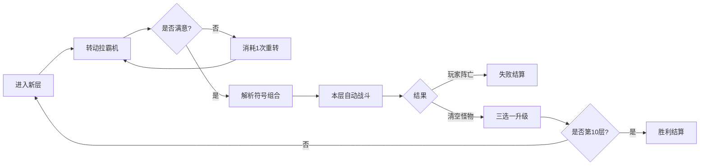

# 拉霸肉鸽 (Slot Roguelike) — 玩法设计文档

> 源文件：`../haqi_slot_roguelike.html`
> 类型：单页 HTML5 小游戏 · 拉霸机 + 肉鸽爬塔 + 自动战斗

## 核心循环

## 玩法概述

玩家在 10 层肉鸽爬塔中，每层转动一台 3 列 × 6 符号的哈奇拉霸机，摇出的「元素 + 技能 + 修饰」三类符号组合成本层自动战斗的技能词缀，自动击退屏幕上的哈奇怪物。每 3 层一个 BOSS（第 3/6/10 层），每层通关后从三张卡中选一张永久强化。玩家 HP 归零即结束。

## 符号体系

### 三类符号

| 类型 | 符号 | 说明 |
|---|---|---|
| 元素 | 🔥 火 / ❄️ 冰 / ⚡ 雷 / 🌿 自然 | 带克制环：火>冰>雷>自然>火 |
| 技能 | 💥 连击 / 🎯 穿透 / ✨ 暴击 / 🩸 吸血 | 决定攻击形态 |
| 修饰 | 🔒 锁定 / ✖️ 倍率 / 🌊 扩散 / ⭐ 万能 | 附加效果 |

### 组合解析规则

| 组合 | 结果 |
|---|---|
| 三连同元素 | 强力元素 AOE，伤害 ×3 |
| 两连同元素 + 一技能 | 元素技能，伤害 ×2（连击则多段） |
| 三连技能 | 纯技能爆发，AOE，无视防御 |
| 单技能 | 基础技能，伤害 ×1.3 |
| 无组合 | 基础普攻 |

修饰符效果：🔒 锁定（下回合保留该符号）/ ✖️ 倍率（伤害 ×2）/ 🌊 扩散（变 AOE）/ ⭐ 万能（可当任意元素）。

## 关卡设计

| 层 | 名称 | 敌人HP | 速度 | 数量 | BOSS | 弱点 | 奖励 |
|---|---|---|---|---|---|---|---|
| 1 | 萌新小怪 | 22 | 18 | 4 | — | — | 10 |
| 2 | 草丛骚动 | 30 | 20 | 5 | — | — | 14 |
| 3 | 烈焰BOSS | 60×6 | 16 | 3 | ✓ | 冰 | 30 |
| 4 | 寒霜来袭 | 44 | 22 | 6 | — | — | 18 |
| 5 | 雷云密布 | 54 | 24 | 6 | — | — | 22 |
| 6 | 冰封BOSS | 120×6 | 18 | 3 | ✓ | 雷 | 40 |
| 7 | 暗影潜行 | 70 | 26 | 7 | — | — | 26 |
| 8 | 狂暴兽群 | 84 | 28 | 8 | — | — | 30 |
| 9 | 终焉前奏 | 100 | 30 | 8 | — | — | 34 |
| 10 | 终极BOSS | 220×6 | 20 | 4 | ✓ | 火 | 80 |

BOSS 层首次转动保底至少一对同元素，避免运气太差直接团灭。命中 BOSS 弱点元素伤害 ×2。

## 难度

| 难度 | 敌人HP | 敌人速度 | 奖励 | 积分倍率 |
|---|---|---|---|---|
| 轻松 | ×0.8 | ×0.85 | ×1.1 | ×0.9 |
| 普通 | ×1.0 | ×1.0 | ×1.0 | ×1.0 |
| 困难 | ×1.3 | ×1.15 | ×0.9 | ×1.3 |

## 升级池（三选一）

| 卡 | 效果 |
|---|---|
| ⚔️ 锋锐 | 基础伤害 +25% |
| 🎯 锐眼 | 暴击率 +15% |
| ❤️ 坚韧 | 最大生命 +30 |
| 🩸 吸血 | 吸血 +8% |
| 🔄 再转 | 每层重转次数 +1 |
| 🔥/❄️/⚡/🌿 之心 | 对应元素伤害 +40% |
| 💨 急速 | 技能释放间隔 -15% |

## 重转机制

- 每层默认 1 次免费重转（升级「再转」可增加）。
- 重转不消耗资源，仅消耗次数。
- 首次转动免费，重转按钮消耗重转次数。

## 积分与结算

- 击杀小怪 +10 分，BOSS +50 分。
- 通关每层奖励 `lv.reward × scoreScale`。
- `earnedPoints = clamp(20, 260, round(score/16) + (won?40:0))`，防止拉霸暴击导致积分失控。
- 最佳层数与最高分存入 `localStorage`。

## 技术实现

- 单文件 HTML，Tailwind CDN，Canvas 2D 战斗渲染。
- 遵循 AGENTS.md：`game_config` + `art_assets` 声明式段，标准 `postMessage` 协议（`gameLoaded`/`gameStarted`/`gameFinished`）。
- 玩家精灵图向宿主请求 `haqi_get_pet_image`，带 robust 回退（900ms 后请求 `haqi_get_pet_images` 取首个）。
- 移动端 `@media (max-width:768px)` 适配，转轮与战场上下排布。
